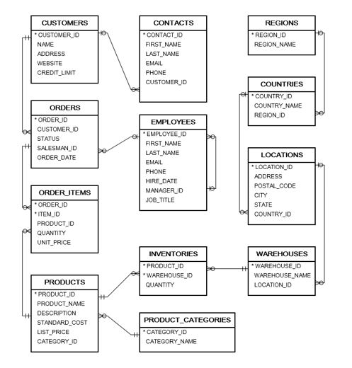
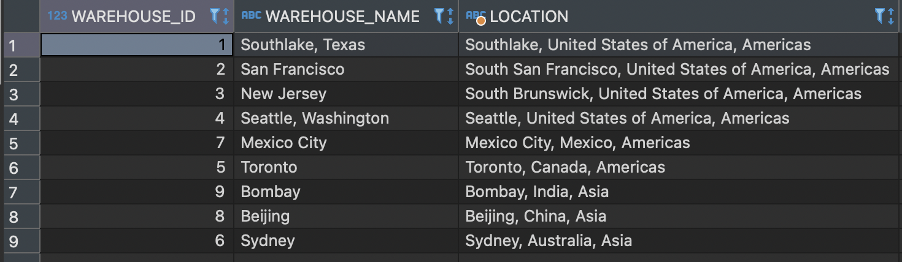
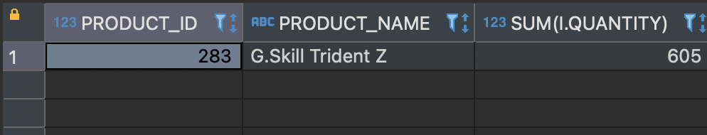
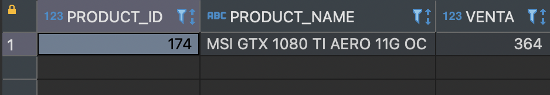
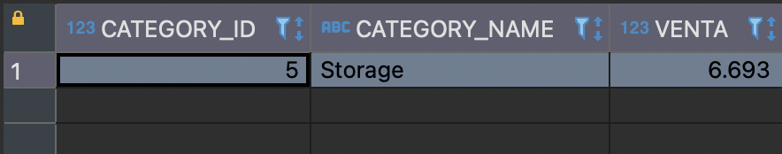
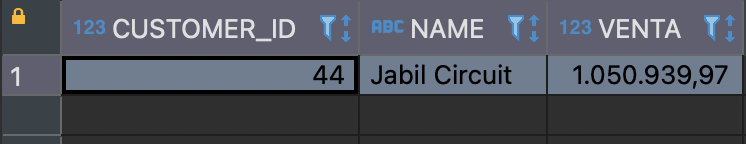
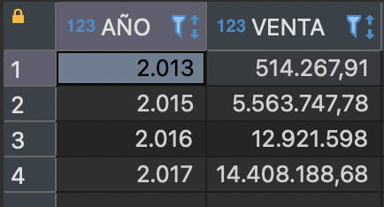
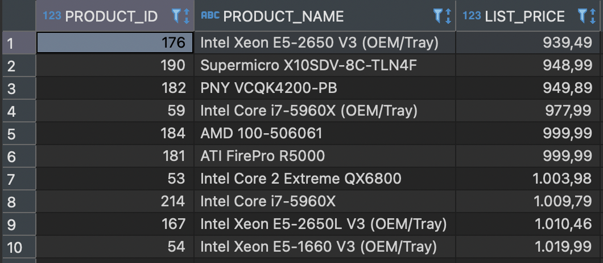
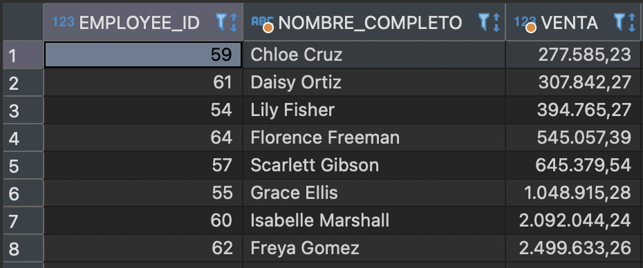
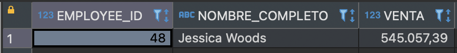

# M1B1T1_AI1:  Consultas a bases de datos relacionales con SQL
#### Autor: Leandro Gutierrez
#### Este documento intenta dar respuesta a las actividades propuestas en el Modulo 1 Bloque 1 del Master en Big Data y Ciencia de Datos. En él se describirán cada uno de los enunciados postulados y los resultados obtenidos a través del uso de la base de datos relacional Oracle y su interfaz SQL.
#### Abril 05, 2024
---	

### Descripción
Has sido contratado por una multinacional como Data Engineer. Se trata de una empresa global que vende hardware informático, incluidos almacenamiento, placas base, RAM, tarjetas de video y CPUs.

Te dan acceso a su base de datos relacional, la cual está montada en un servidor Oracle. El modelo de datos (tablas, campos y relaciones) es el siguiente:


### Ejercicio 1 
> ¿Cuáles son los datos de los almacenes que tiene la compañía? Se necesita:
> - Identificador del almacén.
> - Nombre del almacén.
> - Nombre de la ciudad, país y región donde está ubicado. 
#### SQL
```
select  w.warehouse_id,
        w.warehouse_name,
        l.city||', '||c.country_name||', '|| r.region_name as LOCATION
from warehouses w
inner join locations l on l.location_id = w.location_id
inner join countries c on c.country_id = l.country_id
inner join regions r on r.region_id = c.region_id
order by r.region_id;
```
#### Resultados

#### Respuesta
La compañia cuenta con 9 depósitos. Desplegados en:
- 2 regiones: América y Asia.
- 6 paises: Estados Unidos, México, Canadá, India, China y Australia
- 9 Ciudades: South Lake, San Francisco, New Jersey, Seattle, Mexico DF, Toronto, Bombay, Beijin y Sydney.

### Ejercicio 2
> ¿Cuál es el nombre del producto que tiene más stock en Asia?
#### SQL
```
with ranking as (
	select  p.product_id,
	        p.product_name,
	    	sum(i.quantity)
	from products p
	inner join inventories i on i.product_id = p.product_id
	inner join warehouses w on w.warehouse_id = i.warehouse_id
	inner join locations l on l.location_id = w.location_id
	inner join countries c on c.country_id = l.country_id
	inner join regions r on r.region_id = c.region_id
	where r.region_name = 'Asia' 
	group by p.product_id, p.product_name, r.region_id
	order by sum(i.quantity) desc
)
select * from ranking where rownum = 1;
```
#### Resultados

#### Respuesta
El producto de mayor stock en la región asiatica es la **Memoria RAM DDR4 G.Skill Trident Z**


### Ejercicio 3
> ¿Cuál es el producto que ha vendido más unidades durante 2016?
#### SQL
```
with ranking as (
	select  p.product_id,
	        p.product_name,
	        sum(oi.quantity) venta
	from orders o
	inner join order_items oi on oi.order_id = o.order_id
	inner join products p on p.product_id = oi.product_id
	where extract(year from o.order_date) = '2016'
	and o.status = 'Shipped'
	group by p.product_id, p.product_name
	order by venta desc
)
select * from ranking where rownum = 1;
```
#### Resultados

#### Respuesta
El producto de más vendido durante el año 2016 fué la **Placa de video MSI GTX 1080 TI AERO 11G OC**.

### Ejercicio 4
> ¿Cuál es la categoría de productos que ha vendido más unidades durante 2017?
#### SQL
```
with ranking as (
	select  c.category_id,
	        c.category_name,
	        sum(oi.quantity) venta
	from orders o
	inner join order_items oi on oi.order_id = o.order_id
	inner join products p on p.product_id = oi.product_id
	inner join product_categories c on c.category_id = p.category_id
	where extract(year from o.order_date) = '2017'
	and o.status = 'Shipped'
	group by c.category_id, c.category_name
	order by venta desc
)
select * from ranking where rownum = 1;
```
#### Resultados

#### Respuesta
La categoría mas vendida durante 2017 fué **Storage (Almacenamiento)**.

### Ejercicio 5
> ¿Cuál es el nombre del cliente cuyo gasto ha sido más alto en 2015?
#### SQL
```
with ranking as (
	select  c.customer_id,
	    	c.name,
	        sum(oi.quantity * oi.unit_price) venta
	from orders o
	inner join order_items oi on oi.order_id = o.order_id
	inner join products p on p.product_id = oi.product_id
	inner join customers c on c.customer_id = o.customer_id
	where extract(year from o.order_date) = '2015'
	and o.status = 'Shipped'
	group by c.customer_id, c.name
	order by venta desc
)
select * from ranking where rownum = 1;
```
#### Resultados

#### Respuesta
El cliente que mas gastó durante el año 2015 fué el manufacturador de productos electrónicos de alta complejidad a escala mundial **Jabil Circuit (https://www.jabil.com/)**.

### Ejercicio 6
> ¿Cuánto ha facturado la compañía en cada uno de los años de los que tiene datos?
#### SQL
```
select 	extract(year from o.order_date) as año,
    	sum(oi.quantity * oi.unit_price) venta
from orders o
inner join order_items oi on oi.order_id = o.order_id
and o.status = 'Shipped'
group by extract(year from o.order_date)
order by año asc;
```
#### Resultados

#### Respuesta
Los datos cuentan con ventas desde el año 2013 al 2017, con excepcion del año 2014, en el cual no se registraron ventas. En los resultados se aprecia un crecimiento progresivo en las ventas en cada resultado anual. Logrando una tasa de mejora aproximada del **2690%**
Considerando:
$$
Tasa\ de\ crecimiento\% = ((Valor\ inicial - Valor\ final)/Valor\ inicial)×100
$$

### Ejercicio 7
> ¿Cuáles son los nombres de los productos cuyo precio es superior la media?
#### SQL
```
select 	p.product_id,
    	p.product_name,
    	list_price
from products p
where list_price > (select avg(list_price) from products)
order by list_price asc;
```
#### Resultados


Nota: solo se muestran los primeros 10 resultados, en total el listado comprende 85 articulos.
#### Respuesta
Con una media de precio al rededor de los **903.24**, encontramos unos 85 productos cuyo valor es superior a dicho promedio.

### Ejercicio 8
> ¿Cuáles son los empleados (nombre y apellido) que han facturado más de 50.000 $ durante 2017?
#### SQL
```
select  e.employee_id,
    	(e.first_name || ' ' || e.last_name) as nombre_completo,
        sum(oi.quantity * oi.unit_price) as venta
from orders o
inner join order_items oi on oi.order_id = o.order_id
inner join employees e on e.employee_id = o.salesman_id
where extract(year from o.order_date) = '2017'
and o.status = 'Shipped'
group by e.employee_id, (e.first_name || ' ' || e.last_name)
having sum(oi.quantity * oi.unit_price) > 50000
order by venta asc;
```
#### Resultados

#### Respuesta
Encontramos 8 empleados cuya facturación durante el año 2017 fué superior a los $50.000. El primer lugar lo ocupa **Freya Gomez, con una facturación total de $2.499.633,26**

### Ejercicio 9
> ¿Cuánto clientes no tienen persona de contacto?
#### SQL
```
select count(customer_id)
from customers 
where customer_id not in (select customer_id from contacts);
```
#### Resultados

#### Respuesta
No encontramos clientes sin contacto asignado en la bas de datos.

### Ejercicio 10
> ¿Cuál es el Manager (nombre y apellido identificado por el campo manager_id) que menos ha facturado durante 2017?
#### SQL
```
with ranking as (
	select  m.employee_id,
	    	(m.first_name || ' ' || m.last_name) as nombre_completo,
	        sum(oi.quantity * oi.unit_price) as venta
	from orders o
	inner join order_items oi on oi.order_id = o.order_id
	inner join employees e on e.employee_id = o.salesman_id
	inner join employees m on m.employee_id = e.manager_id
	where extract(year from o.order_date) = '2017'
	and o.status = 'Shipped'
	group by m.employee_id, (m.first_name || ' ' || m.last_name)
	order by venta asc
)
select * from ranking where rownum = 1;
```
#### Resultados

#### Respuesta
De los 3 managers que registraron ventas durante el año 2017, fué **Jessica Woods quién menos facturó, con un total de $545057.39** durante el período analizado.