# M1B1T1_AG1_GRUPO_5: Procesamiento de datos con Spark 2.x. Datos de ventas
#### Autores: Jorge Leodeg Ramirez Diaz y Leandro Gutierrez
#### Grupo: 5
#### Este documento intenta dar respuesta a las actividades propuestas en el Modulo 1 Bloque 1 Actividad Grupal 1. En él se describirán cada uno de los enunciados postulados y los resultados obtenidos a través del uso de Spark y sus APIs DataFrame y SQL 
#### Abril 22, 2024
---	

### Descripción
Habéis sido contratados por una empresa perteneciente al sector del Retail. Es una empresa con presencia a nivel mundial con sede en España. Tiene tanto tiendas físicas, como venta on-line.

Todos los días recibe un archivo llamado purchases.json con compras realizadas en todo el mundo

Cada línea del fichero es una compra de una unidad del producto correspondiente

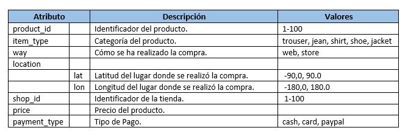

La plataforma logística envía todos los días un archivo stock.csv con el stock de cada producto:

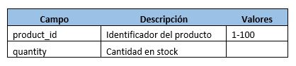

Nota: Los datos se han generado de forma aleatoria.

### Ejercicio 1 
> Obtén los 10 productos más comprados.
#### Query
```python
    # DataFrame
    df_purchases\
        .groupBy("product_id")\
        .count()\
        .orderBy("count", ascending=False)\
        .limit(10)\
        .show()

    # SQL
    df_purchases.createOrReplaceTempView("purchases")
    sql_purchases = spark.sql("""
                              SELECT product_id, COUNT(*) AS cant
                              FROM purchases
                              GROUP BY product_id
                              ORDER BY cant DESC
                              LIMIT 10
                              """)
    sql_purchases.show()
```
#### Resultados
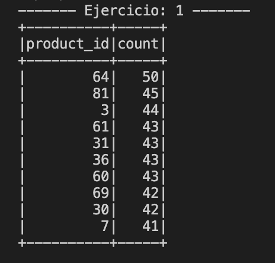

#### Respuesta
El listado de los 10 productos mas vendidos se puede apreciar en la imagen superior, donde el **product_id = 64** lidera el ranking con **50 ventas**.

### Ejercicio 2
> Porcentaje de compra de cada tipo de producto (item_type).
#### Query
```python
    # DataFrame
    total_purchases = df_purchases.\
        count()

    df_purchases\
        .groupBy("item_type")\
        .count()\
        .withColumn("porcentage", F.col("count")/total_purchases*100)\
        .show()

    # SQL
    df_purchases.createOrReplaceTempView("purchases")
    sql_purchases = spark.sql("""
                            WITH total AS (
                                SELECT COUNT(*) total
                                FROM purchases
                            )
                            SELECT item_type,
                                    total.total total,
                                    COUNT(*) cant,
                                    cant/total*100 as porcentage
                            FROM purchases
                            CROSS JOIN total
                            GROUP BY item_type, total.total
                            """)
    sql_purchases.show()
```
#### Resultados
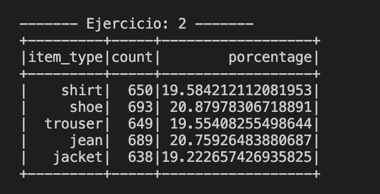

#### Respuesta
La imagen anterior muestra la distribución de las ventas respecto a cada tipo de item (**item_type**). Se nota un equilibrio en torno a un **20%** para cada una de las 5 categorias.

### Ejercicio 3
> Obtener los 3 productos más comprados por cada tipo de producto.
#### Query
```python
    # DataFrame
    w = Window.partitionBy("item_type").orderBy(F.col("count").desc())

    df_purchases\
        .groupBy("product_id", "item_type")\
        .count()\
        .withColumn("rank", F.row_number().over(w))\
        .orderBy("item_type", "rank", "product_id")\
        .where(F.col("rank") <= 3)\
        .show()

    # SQL
    df_purchases.createOrReplaceTempView("purchases")
    sql = spark.sql("""
    WITH ranked AS (
      SELECT product_id, item_type, COUNT(*) AS count,
      ROW_NUMBER() OVER (PARTITION BY item_type ORDER BY COUNT(*) DESC) AS rank
      FROM purchases
      GROUP BY product_id, item_type
    )
    SELECT product_id, item_type, count, rank
    FROM ranked
    WHERE rank <= 3
    ORDER BY item_type, rank, product_id
    """)
    sql.show()
```
#### Resultados
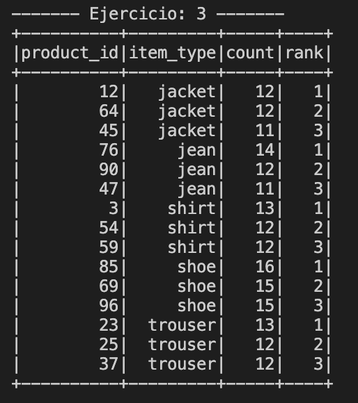

#### Respuesta
La imagen anterior muestra el ranking de los 3 productos más comprados por cada una de las 5 categorías existentes.

### Ejercicio 4
> Obtener los productos que son más caros que la media del precio de los productos.
#### Query
```python
    # DataFrame
    precio_promedio = df_purchases.agg(F.avg('price')).collect()[0][0]

    df_purchases\
        .select("product_id", "item_type", "price")\
        .where(F.col("price").cast("float") > precio_promedio)\
        .orderBy(F.col("price"))\
        .show()

    # SQL
    df_purchases.createOrReplaceTempView("purchases")
    sql = spark.sql("""
                    SELECT product_id, item_type, price
                    FROM purchases
                    WHERE price > (SELECT AVG(price) FROM purchases)
                    ORDER BY price ASC
                    """)
    sql.show()
```
#### Resultados
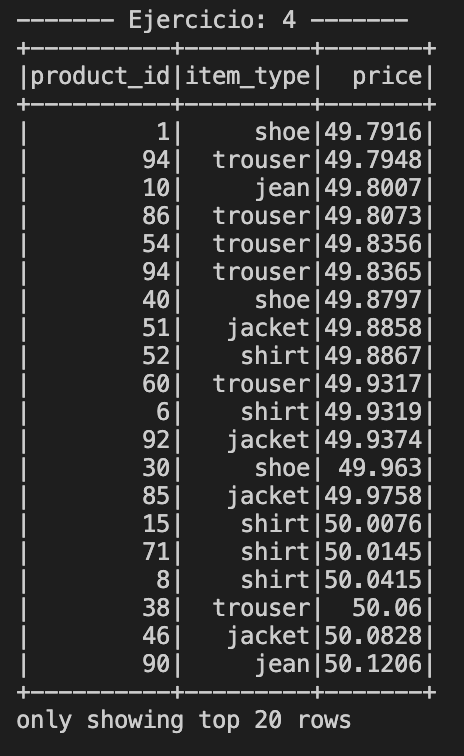

#### Respuesta
Con una **media de precio de 49.78**, la imagen anterior muestra **los primeros 20 productos** cuyo valor es superior al valor medio.

### Ejercicio 5
> Indicar la tienda que ha vendido más productos.
#### Query
```python
    # DataFrame
    df_purchases\
        .groupBy("shop_id")\
        .count()\
        .orderBy(F.col("count"), ascending=False)\
        .limit(1)\
        .show()

    # SQL
    df_purchases.createOrReplaceTempView("purchases")
    sql = spark.sql("""
                    SELECT shop_id, COUNT(*) AS count
                    FROM purchases
                    GROUP BY shop_id
                    ORDER BY count DESC
                    LIMIT 1
                    """)
    sql.show()
```
#### Resultados
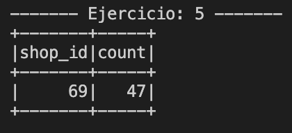

#### Respuesta
La **tienda 69** lidera el ranking de ventas **con un total de 47 transacciones**.

### Ejercicio 6
> Indicar la tienda que ha facturado más dinero.
#### Query
```python
    # DataFrame
    df_purchases\
        .groupBy("shop_id")\
        .agg({"price": "sum"})\
        .orderBy(F.col("sum(price)"), ascending=False)\
        .limit(1)\
        .show()

    # SQL
    df_purchases.createOrReplaceTempView("purchases")
    sql = spark.sql("""
                    SELECT shop_id, ROUND(SUM(price), 2) AS sum
                    FROM purchases
                    GROUP BY shop_id
                    ORDER BY sum DESC
                    LIMIT 1
                    """)
    sql.show()
```
#### Resultados
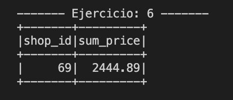

#### Respuesta
Al igual que en el punto anterior es la **tienda 69** la que lidera el ranking de facturación, con un total de **$2444.89**.
### Ejercicio 7
> Dividir el mundo en 5 áreas geográficas iguales según la longitud (location.lon) y agregar una columna con el nombre del área geográfica 
> Area1: - 180 a - 108, Area2: - 108 a - 36, Area3: - 36 a 36, Area4: 36 a 108, Area5: 108 a 180.
#### 7.1
> ¿En qué área se utiliza más PayPal?
#### Query
```python
    # DataFrame
    df_purchases\
        .withColumn("area",
                    F.when(F.col("location.lon").between(-180, -108), "Area1")
                    .when(F.col("location.lon").between(-108, -36), "Area2")
                    .when(F.col("location.lon").between(-36, 36), "Area3")
                    .when(F.col("location.lon").between(36, 108), "Area4")
                    .when(F.col("location.lon").between(108, 180), "Area5")
                    .otherwise("Area6")
                    )\
        .groupBy(F.col("area"), F.col("payment_type"))\
        .count()\
        .where(F.col("payment_type") == "paypal")\
        .orderBy(F.col("count"), ascending=False)\
        .limit(1)\
        .show()

    # SQL
    df_area = spark.sql("""
        SELECT *,
        CASE
            WHEN location.lon >= -180 AND location.lon < -108 THEN 'Area1'
            WHEN location.lon >= -108 AND location.lon < -36 THEN 'Area2'
            WHEN location.lon >= -36 AND location.lon < 36 THEN 'Area3'
            WHEN location.lon >= 36 AND location.lon < 108 THEN 'Area4'
            WHEN location.lon >= 108 AND location.lon <= 180 THEN 'Area5'
            ELSE 'Area6' END
        AS area
        FROM purchases
        """)

    df_area.createOrReplaceTempView("purchases_area")
    df_metodos_pago = spark.sql("""
                                SELECT  area,
                                        payment_type,
                                        count(payment_type) as count
                                FROM purchases_area
                                WHERE payment_type = 'paypal'
                                GROUP BY area, payment_type
                                SORT BY count DESC
                                LIMIT 1
                                """)
    df_metodos_pago.show()
```
#### Resultados
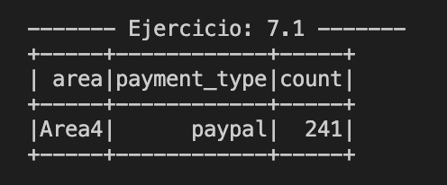

#### Respuesta
Es el **Area4 (- 180 a - 108)** donde paypal es el método de pago mas utilizado, con un total de **241 transacciones** completadas.

#### 7.2
> ¿Cuáles son los 3 productos más comprados en cada área?
#### Query
```python
    # DataFrame
    w = Window.partitionBy("area")\
        .orderBy(F.col("count").desc(), F.col("product_id").desc())

    df_purchases\
        .withColumn("area",
                    F.when(F.col("location.lon").between(-180, -108), "Area1")
                    .when(F.col("location.lon").between(-108, -36), "Area2")
                    .when(F.col("location.lon").between(-36, 36), "Area3")
                    .when(F.col("location.lon").between(36, 108), "Area4")
                    .when(F.col("location.lon").between(108, 180), "Area5")
                    .otherwise("Area6")
                    )\
        .groupBy(F.col("area"), F.col("product_id"))\
        .count()\
        .withColumn("rank", F.row_number().over(w))\
        .sort(F.col("area").asc(), F.col("rank").asc())\
        .where(F.col("rank") <= 3)\
        .show()

    # SQL
    df_purchases.createOrReplaceTempView("purchases")
    sql = spark.sql("""
    WITH base AS (
        SELECT
            product_id,
            CASE
                WHEN location.lon BETWEEN -180 and -108 THEN "Area1"
                WHEN location.lon BETWEEN -108 and -36 THEN "Area2"
                WHEN location.lon BETWEEN -36 and 36 THEN "Area3"
                WHEN location.lon BETWEEN 36 and 108 THEN "Area4"
                WHEN location.lon BETWEEN 108 and 180 THEN "Area5"
                ELSE "Area6"
            END AS area,
            COUNT(1) AS count
        FROM purchases
        GROUP BY product_id, area
    ), ranking AS (
      SELECT  area,
      product_id,
      count,
      ROW_NUMBER() OVER (PARTITION BY area ORDER BY count DESC, product_id DESC) AS rank
      FROM base
    )
    SELECT * from ranking
    WHERE rank <= 3
    ORDER BY area ASC, rank ASC
    """)
    sql.show()
```
#### Resultados
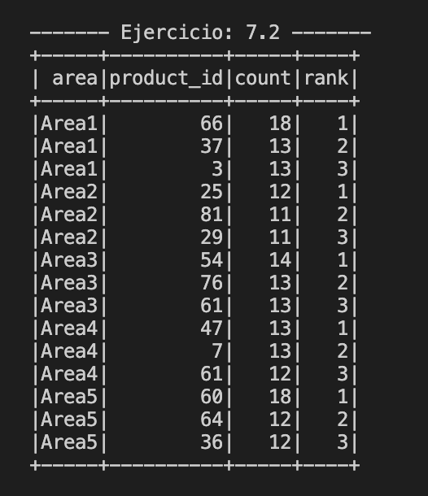

#### Respuesta
La imagen anterior muestra los productos mas solicitados en cada una de las 5 Areas definidas.

#### 7.3
> ¿Qué área ha facturado menos dinero?
#### Query
```python
    # DataFrame
    df_purchases\
        .withColumn("area",
                    F.when(F.col("location.lon").between(-180, -108), "Area1")
                    .when(F.col("location.lon").between(-108, -36), "Area2")
                    .when(F.col("location.lon").between(-36, 36), "Area3")
                    .when(F.col("location.lon").between(36, 108), "Area4")
                    .when(F.col("location.lon").between(108, 180), "Area5")
                    .otherwise("Area6")
                    )\
        .groupBy(F.col("area"))\
        .sum("price")\
        .withColumn("sum(price)", F.round(F.col("sum(price)"), 2))\
        .orderBy(F.col("sum(price)"))\
        .limit(1)\
        .show()


    # SQL
    df_purchases.createOrReplaceTempView("purchases")
    df_facturacion = spark.sql("""
                SELECT
                    CASE
                        WHEN location.lon BETWEEN -180 and -108 THEN "Area1"
                        WHEN location.lon BETWEEN -108 and -36 THEN "Area2"
                        WHEN location.lon BETWEEN -36 and 36 THEN "Area3"
                        WHEN location.lon BETWEEN 36 and 108 THEN "Area4"
                        WHEN location.lon BETWEEN 108 and 180 THEN "Area5"
                        ELSE "Area6"
                    END AS area,
                    ROUND(SUM(price), 2) AS venta
                FROM purchases
                GROUP BY area
                ORDER BY venta asc
                LIMIT 1
                """)
    df_facturacion.show()
```
#### Resultados
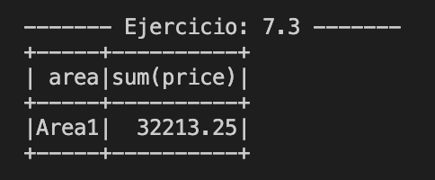

#### Respuesta
El **Area3** es la que menos facturó según los datos con los que se cuentan. Con un total de **$32213.5**.

### Ejercicio 8
> Indicar los productos que no tienen stock suficiente para las compras realizadas.
#### Query
```python
   # DataFrame
    df_purchase_vs_stock = df_purchases.groupby("product_id")\
        .count()\
        .join(df_stock, on="product_id")
    df_purchase_vs_stock.filter("count>quantity").show()

    # SQL
    df_purchases.createOrReplaceTempView("purchases")
    df_stock.createOrReplaceTempView("stock")
    sql = spark.sql("""
                    WITH ventas AS(
                        SELECT product_id, COUNT(1) venta
                        FROM purchases
                        GROUP BY product_id
                    )
                    SELECT v.product_id, v.venta, s.quantity
                    FROM ventas v
                    INNER JOIN stock s ON s.product_id = v.product_id
                    WHERE venta > quantity
                    """)
    sql.show()
```
#### Resultados
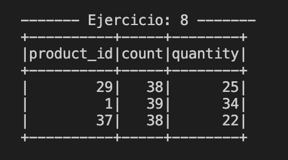

#### Respuesta
Se puede apreciar en los resultados que **3 de los productos no tienen stock suficiente para suplir la demanda**. Los mismos tienen los ids: **29, 1 y 37**