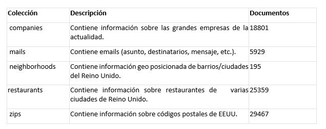
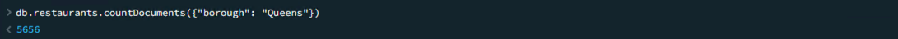
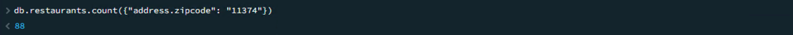
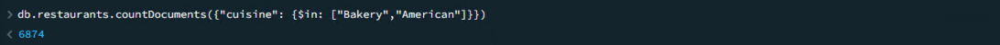
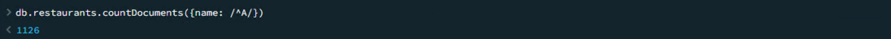
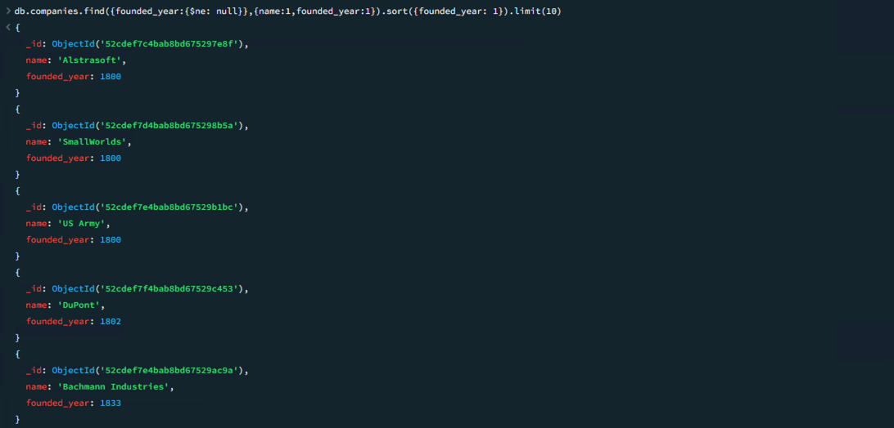
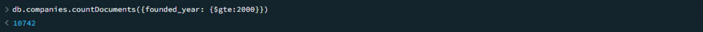
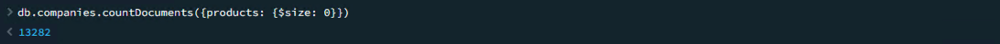
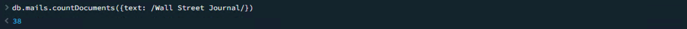
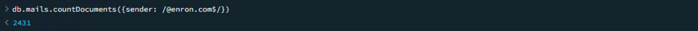

# M1B1T1_AI2: Consultas básicas a base de datos no relacionales con MongoDB
#### Autor: Leandro Gutierrez
#### Este documento intenta dar respuesta a las actividades propuestas en el Modulo 1 Bloque 1 Actividad Individual 2. En él se describirán cada uno de los enunciados postulados y los resultados obtenidos a través del uso de la base de datos documental MongoDB y su interfaz de consulta Shell.
#### Abril 15, 2024
---	

### Descripción
Has sido contratado por una consultora como Data Engineer. Se te da acceso a una base de datos no relacional, la cual está montada en un servidor MongoDB.

Dentro de la base de datos existen varias colecciones:



### Ejercicio 1 
> ¿Cuántos restaurantes pertenecen a la ciudad (borough) de “Queens”? 
#### Query
```js
db.restaurants.countDocuments({"borough": "Queens"})
```
#### Resultados

#### Respuesta
En la colección exisiten 5656 restaurantes cuya ciudad es "Queens".

### Ejercicio 2
> ¿Cuántos restaurantes tienen el código postal 11374?
#### Query
```js
db.restaurants.count({"address.zipcode": "11374"})
```
#### Resultados

#### Respuesta
En la colección exisiten 88 restaurantes cuyo codigo postal es "11374".

### Ejercicio 3
> ¿Cuántos restaurantes son de tipo “American” o “Bakery”?
#### Query
```js
db.restaurants.countDocuments({"cuisine": {$in: ["Bakery","American"]}})
```
#### Resultados

#### Respuesta
Podemos encontrar un total de 6874 restaurantes tipificados como "American" o "Bakery".

### Ejercicio 4
> ¿Cuántos nombres de restaurantes empiezan por la letra “A”?
#### Query
```js
db.restaurants.countDocuments({name: /^A/})
```
#### Resultados

#### Respuesta
Podemos encontrar un total de 1126 restaurantes cuyos nombres comienzan con la letra "A".

### Ejercicio 5
> ¿Cuáles es el nombre de las 10 empresas mas antiguas?
#### Query
```js
db.companies.find({founded_year:{$ne: null}},{name:1,founded_year:1})
.sort({founded_year: 1})
.limit(10)
```
#### Resultados


Nota: en la imagen se aprecian 5 de un total de 10 elementos obtenidos.
#### Respuesta
El siguiente es el listado de las 10 empresas mas antiguas:
- Alstrasoft
- SmallWorlds
- US Army
- DuPont
- McKesson
- Bachmann Industries
- Bertelsmann
- Accuity
- CENTRA
- WeGame

### Ejercicio 6
> ¿Cuántas empresas se fundaron durante o después del año 2000?
#### Query
```js
db.companies.countDocuments({founded_year: {$gte:2000}})
```
#### Resultados

#### Respuesta
Podemos encontrar un total de 10742 empresas fundadas a partir del año 2000.

### Ejercicio 7
> ¿Cuántas empresas tienen entre 500 y 1000 empleados/as?
#### Query
```js
db.companies.countDocuments({number_of_employees: {$gte: 500, $lt:1000}})
```
#### Resultados

#### Respuesta
Existen 106 empresas con un total de empleados entre los 500 y 1000.
Nota: Se considera intervalo cerrado por izquierda y abierto por derecha: [500,1000).

### Ejercicio 8
> ¿Cuántas empresas no tienen productos informados?
#### Query
```js
db.companies.countDocuments({products: {$size: 0}})
```
#### Resultados

#### Respuesta
13282 de las empresas no reportan productos asociados.

### Ejercicio 9
> ¿En cuántos mails aparecen las palabras “Wall Street Journal” en el asunto del correo?
#### Query
```js
db.mails.countDocuments({text: /Wall Street Journal/})
```
#### Resultados

#### Respuesta
La palabra "Wall Street Journal" aparece en 38 emails.

### Ejercicio 10
> ¿Cuántos correos tienen como remitente un correo con dominio @enron.com?
#### Query
```js
db.mails.countDocuments({sender: /@enron.com$/})
```
#### Resultados

#### Respuesta
2431 de los remitentes de mails tienen correo con dominio "@enron.com".

