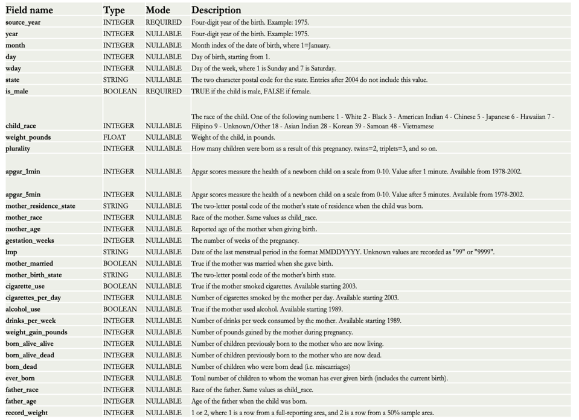
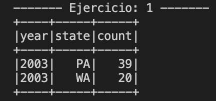
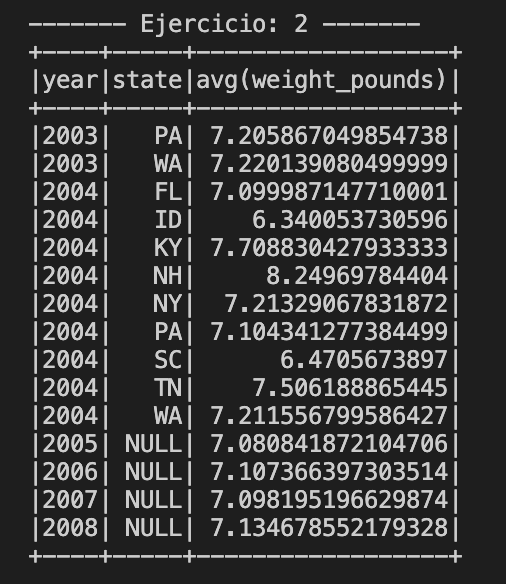
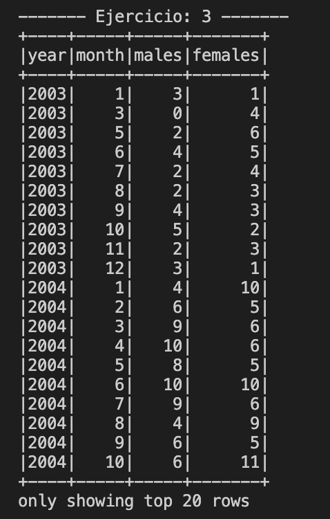
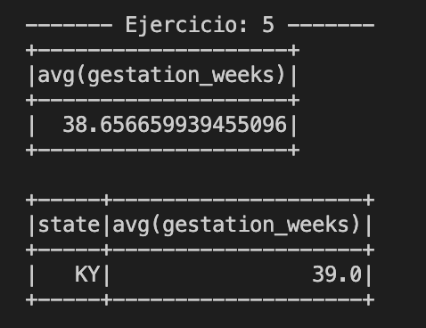
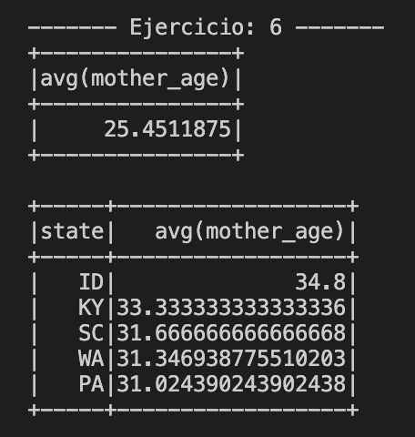
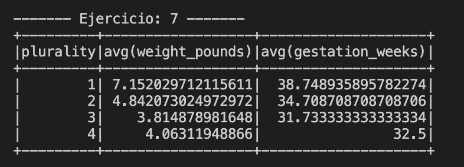

# M1B1T1_AI3: Procesamiento de datos con Spark 2.x. Natalidad EE.UU.
#### Autor: Leandro Gutierrez
#### Este documento intenta dar respuesta a las actividades propuestas en el Modulo 1 Bloque 1 Actividad Individual 3. En él se describirán cada uno de los enunciados postulados y los resultados obtenidos a través del uso de Spark y sus APIs DataFrame y SQL 
#### Abril 20, 2024
---	

### Descripción
Has sido contratado por una empresa consultora como Data Engineer y te proporcionan un fichero CSV con datos reales sobre la natalidad en EE. UU.

El esquema del fichero es el siguiente:



### Ejercicio 1 
> Obtén en qué 10 estados nacieron más bebés en 2003.
#### Query
```python
    # DataFrame
    df.filter(df.year == 2003)\
        .groupBy("year", "state")\
        .count()\
        .orderBy("count", ascending=False)\
        .limit(10)\
        .show()

    # SQL
    df.createOrReplaceTempView("natality")
    sqlDF = spark.sql('''SELECT year, state, COUNT(*) as count
                      FROM natality
                      WHERE year = 2003
                      GROUP BY year, state
                      ORDER BY count desc
                      LIMIT 10''')
    sqlDF.show()
```
#### Resultados

#### Respuesta
Durante el año 2003 solo se cuentan con datos de dos estados PA (Pennsylvania) y WA (Washington), donde se registraron 39 y 20 naciemientos respectivamente.

### Ejercicio 2
> Obtén la media de peso de los bebés por año y estado.
#### Query
```python
    # DataFrame
    df.groupBy("year", "state")\
        .agg({"weight_pounds": "avg"})\
        .sort("year", "state").show()

    # SQL
    df.createOrReplaceTempView("natality")
    sql = spark.sql('''
                    SELECT year, state, AVG(weight_pounds)
                    FROM natality
                    GROUP BY year, state
                    ORDER BY year, state ASC
                    ''')
    sql.show()
```
#### Resultados

#### Respuesta
La imagen superior muestra el desarrollo temporal del peso promedio de los bebes nacidos por año y por estado. El promedio mas alto lo encontramos en NH (Nuevo Hampshire) en el año 2004 con unos 8.24 lb. Mientras que el promedio mas bajo, tambien durante el 2004, en ID (Idaho) de al rededor de unos 6.3 lb.


### Ejercicio 3
>  Evolución por año y por mes del número de niños y niñas nacidas
    (Resultado por separado con una sola consulta cada registro debe tener 4 columnas:
    año, mes, numero de niños nacidos, numero de niñas nacidas).
#### Query
```python
    # DataFrame
    df.groupBy(df.year, "month")\
        .agg(
            F.count(F.when(df.is_male, 1)).alias("males"),
            F.count(F.when(df.is_male == "false", 1)).alias("females"))\
        .sort("year", "month")\
        .show()

    # SQL
    df.createOrReplaceTempView("natality")
    sql = spark.sql('''
                    SELECT  year, month,
                            SUM(IF(is_male = true, 1, 0)) AS males,
                            SUM(IF(is_male = true, 0, 1)) AS females
                    FROM natality
                    GROUP BY year, month
                    ORDER BY year, month ASC
                    ''')
    sql.show()
```
#### Resultados


Nota: solo se muestran las primeras 20 filas
#### Respuesta
La imagen superior muestra la evolución mensual de la tasa de natalidad de Hombres y Mujeres. Se percibe un paulatino crecimiento en el registro de información, probablemente dado a causa de la implementación del registro digital y no a una variacion en la cantidad de nacidos promedio.

### Ejercicio 4
>  Obtén los tres meses de 2005 en que nacieron más bebés.
#### Query
```python
    # DataFrame
    df.where(F.col("year") == "2005")\
        .groupBy("year", "month")\
        .count()\
        .sort("count", ascending=False)\
        .limit(3).show()

    # SQL
    df.createOrReplaceTempView("natality")
    sql = spark.sql('''
                    SELECT year, month, COUNT(*) as cantidad
                    FROM natality
                    WHERE year = 2005
                    GROUP BY year, month
                    ORDER BY cantidad DESC
                    LIMIT 3
                    ''')
    sql.show()
```
#### Resultados


#### Respuesta
Durante el año 2005 los meses donde mas bebés nacieron fueron Marzo (360), Diciembre (352) y Agosto (350).

### Ejercicio 5
>  Obtén los estados donde las semanas de gestación son superiores a la media de EE. UU.
#### Query
```python
    # DataFrame
    avg_gest = df.select(F.avg("gestation_weeks")).collect()[0][0]

    df.groupBy("state")\
        .agg({"gestation_weeks": "avg"})\
        .where(F.col("avg(gestation_weeks)").cast("float") > avg_gest)\
        .show()

    # SQL
    df.createOrReplaceTempView("natality")
    sql = spark.sql('''
                    SELECT state, AVG(gestation_weeks)
                    FROM natality
                    GROUP BY state
                    HAVING AVG(gestation_weeks) > (SELECT AVG(gestation_weeks) FROM natality)
                    ''')
    sql.show()
```
#### Resultados


#### Respuesta
Con una media de gestación Nacional de 38.6 semanas, solo el estado de Kentucky (KY) se encuentra por encima de esta media con 39 semanas de gestación.

### Ejercicio 6
>  Obtén los cinco estados donde la media de edad de las madres ha sido mayor.
#### Query
```python
    # DataFrame
    df.groupBy("state")\
        .agg({"mother_age": "avg"})\
        .orderBy("avg(mother_age)", ascending=False)\
        .limit(5)\
        .show()

    # SQL
    df.createOrReplaceTempView("natality")
    sql = spark.sql('''
                    SELECT state, AVG(mother_age)
                    FROM natality
                    GROUP BY state
                    ORDER BY 2 DESC
                    LIMIT 5
                    ''')
    sql.show()
```
#### Resultados


#### Respuesta
Los estado de Idaho (ID), Kentucky (KY), Carolina de Sur (SC), WA (Washington), PA (Pennsylvania) son los 5 estados con mayor promedio de edad de las madres. Idaho lidera el listado con un promedio de casi 35 años.

### Ejercicio 7
>  Indica cómo influye en el peso del bebé y las semanas de gestación que la madre haya tenido un parto múltiple (campo plurality) a las que no lo han tenido.
#### Query
```python
    # DataFrame
    df.groupBy("plurality")\
        .agg({
            "weight_pounds": "avg",
            "gestation_weeks": "avg"
            })\
        .orderBy("plurality")\
        .show()

    # SQL
    df.createOrReplaceTempView("natality")
    sql = spark.sql('''
                    SELECT plurality, AVG(weight_pounds), AVG(gestation_weeks)
                    FROM natality
                    GROUP BY plurality
                    ORDER BY plurality
                    ''')
    sql.show()
```
#### Resultados


#### Respuesta
Se puede apreciar en los resultados una correlación entre la cantidad de bebés nacientes en el parto, con el peso de cada individuo y con la cantidad de semanas de gestación. Los resultados indican que un parto doble implica en promedio que cada bebé pese un 32% menos de lo que pesa en un bebe nacido en parto simple, además que de media el parto doble acarrea 1 mes menos de gestación. Mientras que si vamos al caso de trillizos, estos pesan en promedio un 53% menos cada uno que un bebé nacido en parto simple y llevan casi 2 meses menos de gestación que el caso simple.