# M1B1T2_AI1: Plataforma como servicio (PaaS) en AWS
#### Autor: Leandro Gutierrez
#### Este documento intenta dar respuesta a las actividades propuestas en el Modulo 1 Bloque 1 Tema 2 del Master en Big Data y Ciencia de Datos. En él se describirán cada uno de los enunciados postulados y los resultados obtenidos utilizando la plataforma Amazon AWS, su servicio RDS (Amazon Relational DataBase Service), y la base de datos relacional PostgreSQL.
#### Abril 29, 2024
---	

### Descripción
Has sido contratado como Data Engineer por una empresa dedicada al mundo del deporte. Dentro de su estrategia definida para los próximos años, está empezando un proyecto para migrar sus aplicaciones a la nube. Para ello, ha elegido Amazon Web Services (AWS) como proveedor de servicios en la nube.

La multinacional tiene en sus instalaciones una base de datos relacional PostgreSQL, donde almacenan resultados de diferentes deportes.

El CDO (Chief Data Officer) ha decidido migrar a AWS, utilizando el servicio Amazon RDS (Amazon Relational DataBase Service) por las ventajas que ofrece usar un servicio PaaS.

Para la migración, han hecho una exportación de las diferentes tablas a ficheros de texto. Una de ellas contiene los resultados de la Liga Española de fútbol.

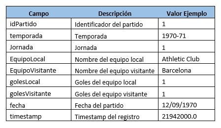

# Sección AWS RDS
-  Crear una base de datos PostgreSQL en AWS utilizando el servicio Amazon RDS.
-  Una vez creada la base de datos, crear una tabla para almacenar los datos.
-  Importar los datos del archivo “Partidos.txt” en la tabla creada.
### Procedimiento
- Una vez iniciado el laboratorio desde https://awsacademy.instructure.com y habiendo ingresado a la plataforma **AWS**, nos dirijimos al servicio **Amazon RDS** el cual nos brinda la capacidad de iniciar una base de datos relacional en la nube de manera sencilla.

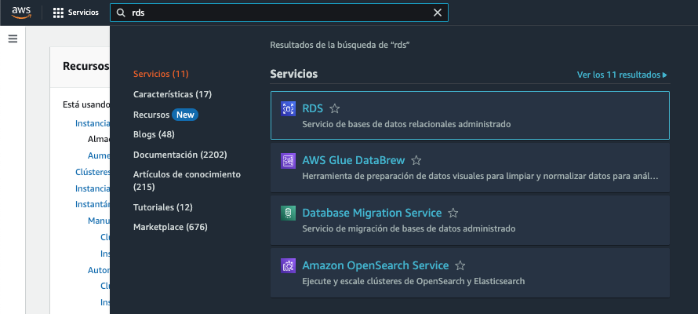

- Una vez dentro del servicio RDS, seleccionamos la opcion "Crear Base de Datos", aquí debemos seleccionar el motor que estemos necesitando, en nuestro caso utilizaremos **PostgreSQL**

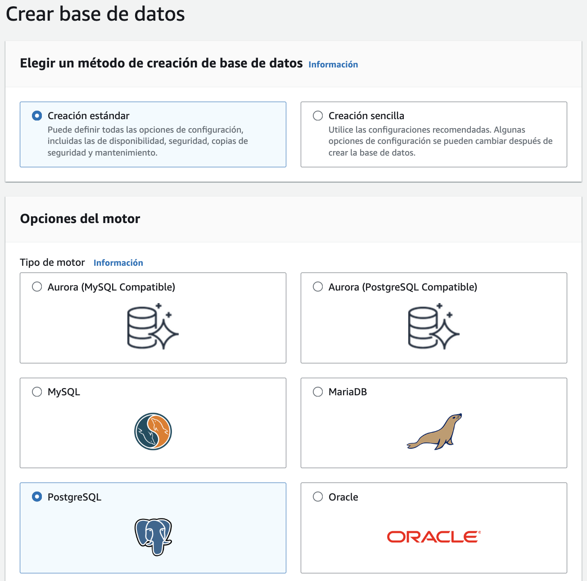

- Dentro de las configuraciones de nuestra DB PostgreSQL, vamos a seleccionar la plantilla **Capa gratuita**, la cual preconfigurará ciertos parametros para adaptarlos a nuestro caso de uso.

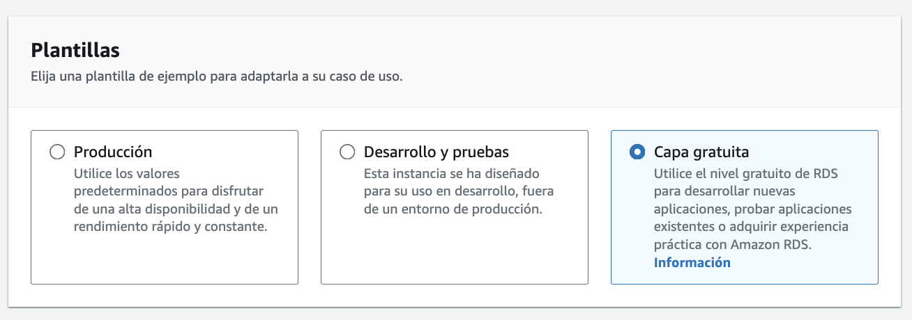

- Siguiendo con las configuraciones de nuestra base de datos, los demás parametros de configuración deben quedar como se muestra en las siguientes capturas de pantalla

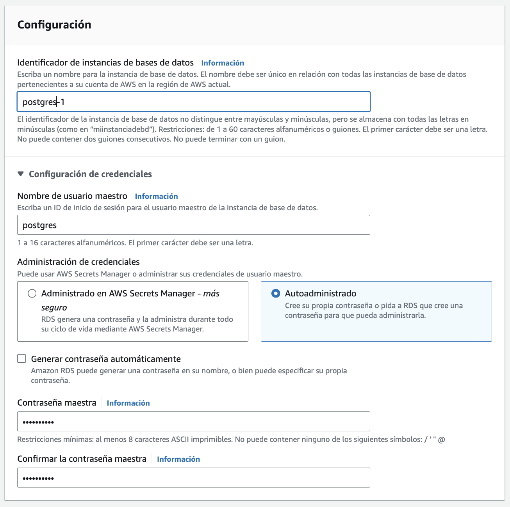

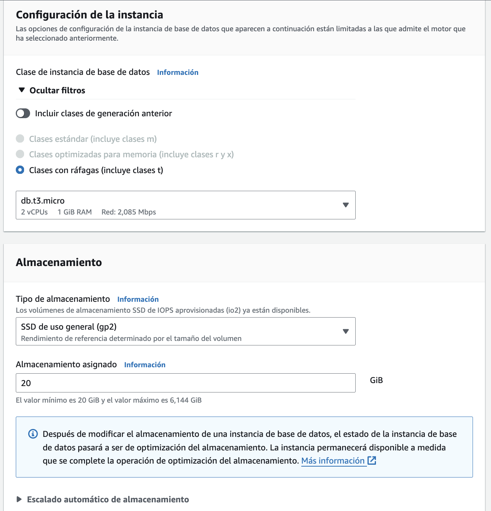

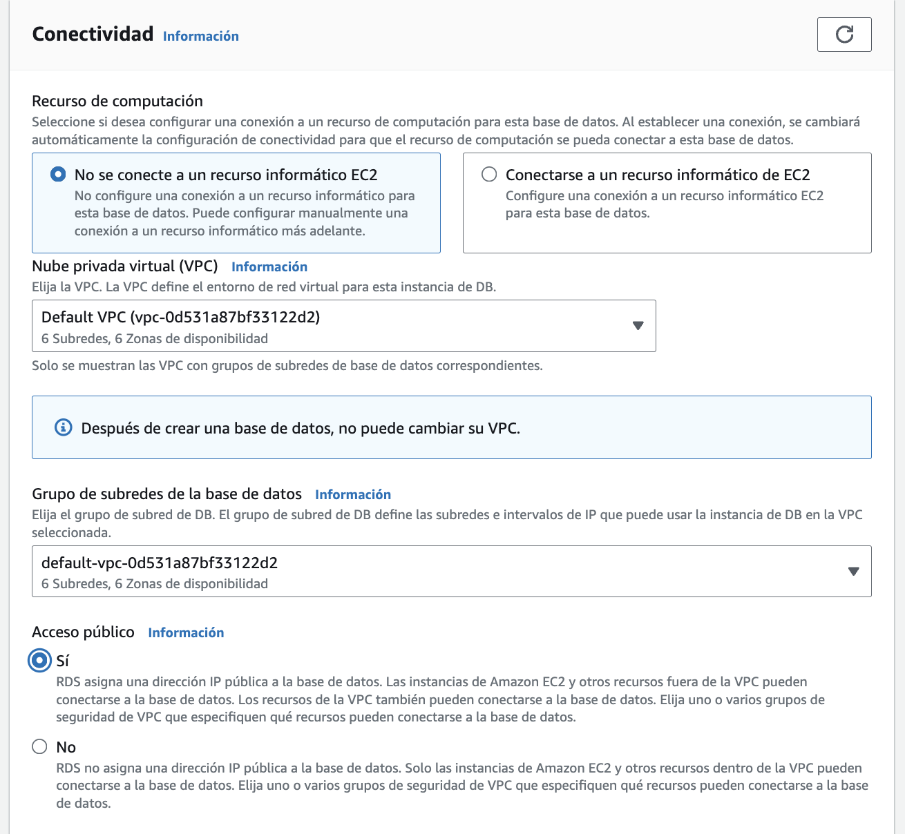

- Una vez seteadas las configuraciones mostradas, damos en **Crear base de datos**

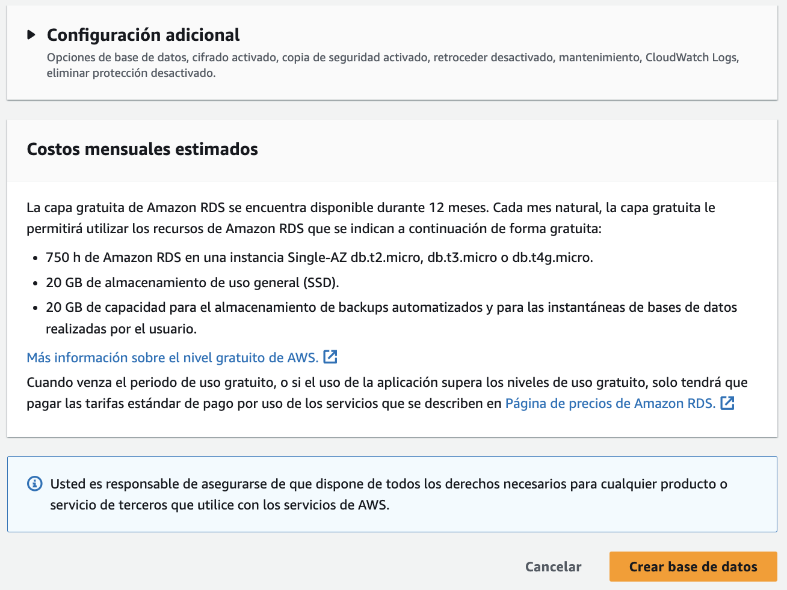

- Esta accicón nos llevará de nuevo al panel principal de RDS, donde al cabo de unos minutos veremos la siguiente notificación y tendremos lista nuestra instancia

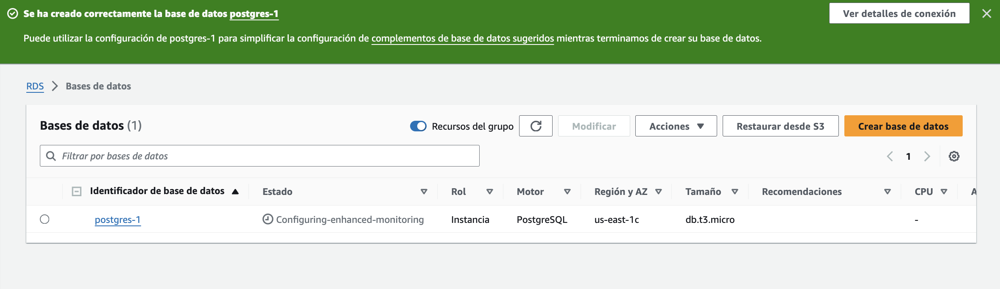

- Para poder acceder desde fuera de la infraestructura cloud de AWS necesitaremos configurar el firewall de nuestra instacia de Postgres, para ello crearemos un **Grupo de seguridad** en el cual indicaremos que vamos a habilitar el acceso al puerto donde está corriendo nuestra base de datos (TCP:5432). Esto lo conseguimos creando una regla de entrada dentro de nuestro grupo de seguridad.

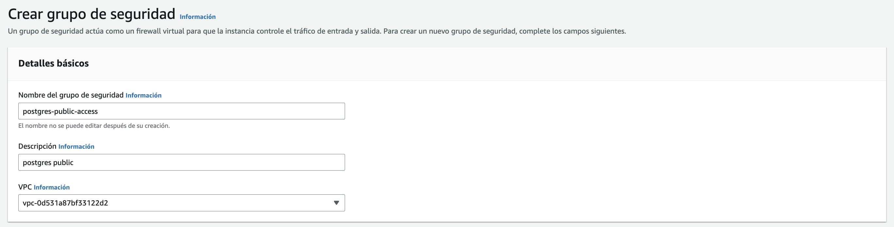

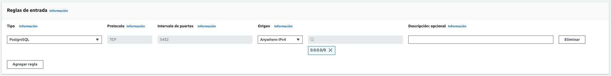

- Quedando nuestra **Grupo de seguridad** como muestra la siguiente captura de pantalla

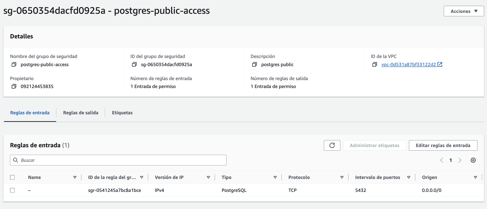

- Ahora si ya tenemos configurada y accesible nuestra base de datos Postgres en Amazon.

- Para conectarnos de manera remota utilizaremos DBeaver como cliente SQL, configurando la conexión en función de los datos que AWS nos provea y de las credenciales que hayamos utilizado durante la creación de la instacia

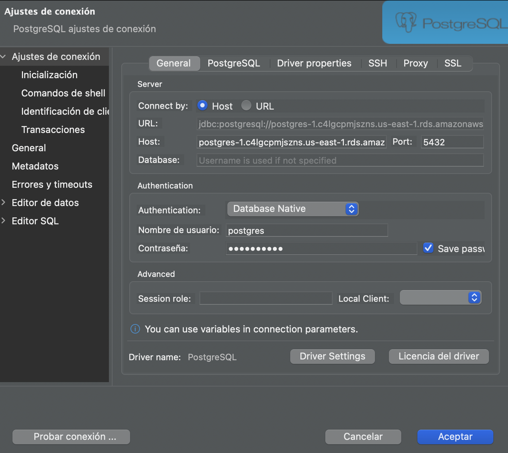

- Testeamos que tengamos conectividad y deberiamos ver el siguiente mensaje de éxito

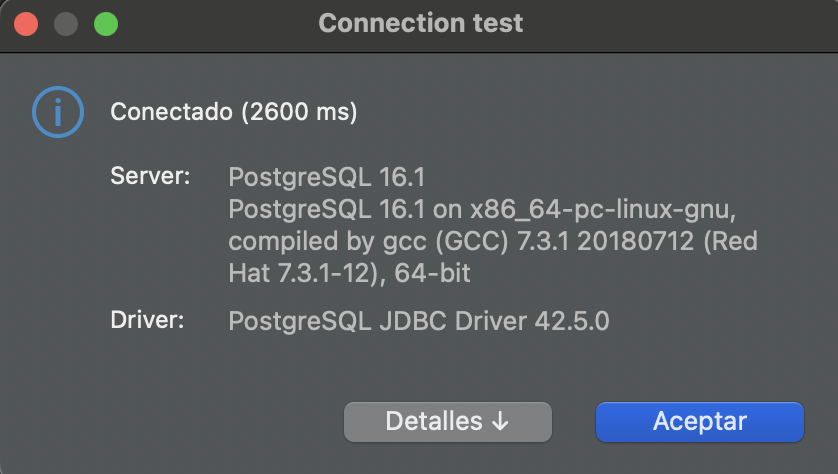

- Una vez conectados a la DB lo proximo será importar los datos, para ello lo primero será crear un schema, en este caso lo llamé *partidos*, luego debemos hacer click secundario sobre nuestro schema creado y clickear **Import Data**

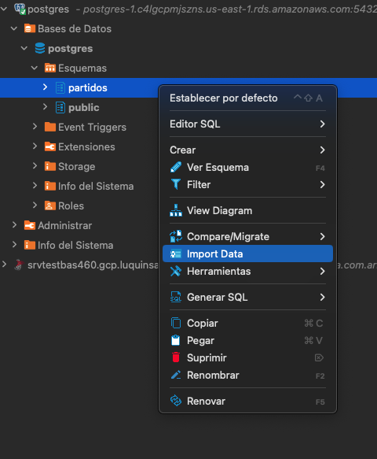

- En la nueva ventana que se abre debemos seleccionar CSV y buscar nuestro archivo. **NOTA: como paso intermedio edité el archivo modificando el separador original por comas (,) y agregué la cabecera con los nombres de las columna segun indica el enunciado** 
  
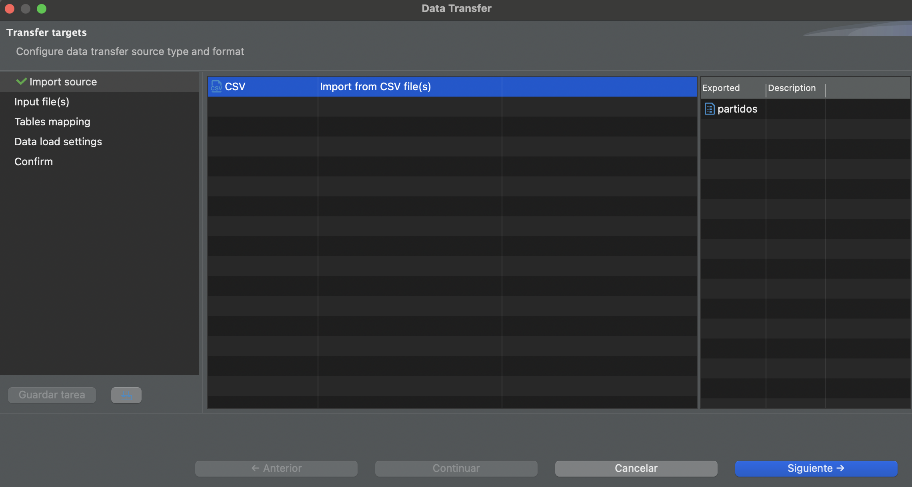

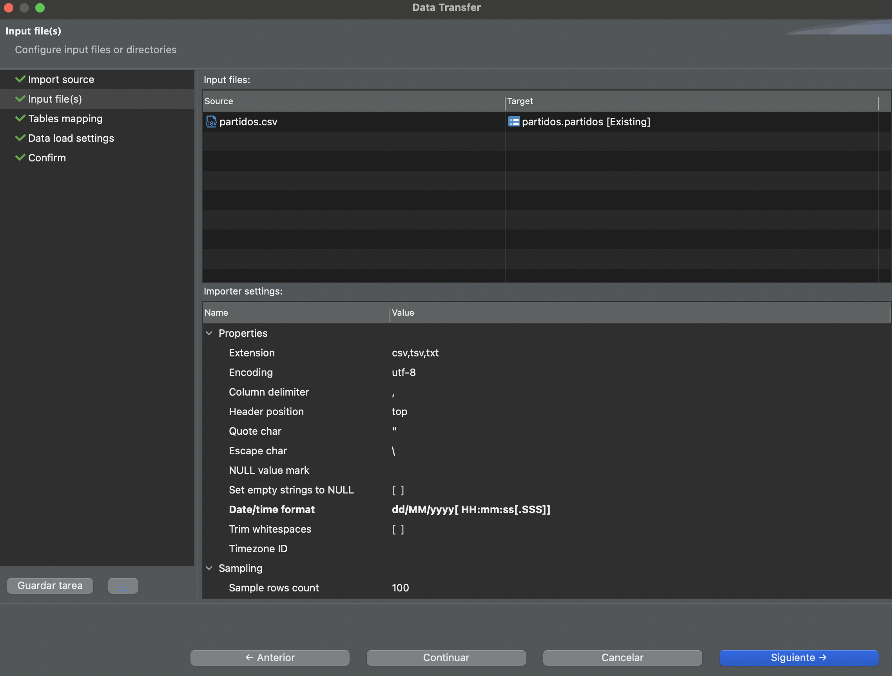

- Culminada la importación, hacemos un checkeo de los datos con una consulta sencilla
```sql
SELECT * FROM partidos
```
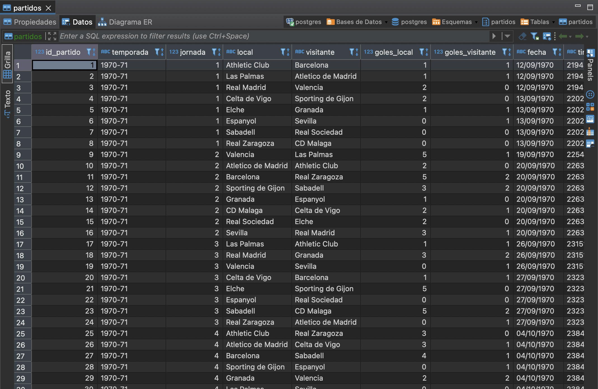

# Sección SQL

### Ejercicio 1 
> ¿Cuántos goles ha marcado el Barcelona?
#### SQL
```sql
SELECT 	SUM(CASE 
				WHEN local = 'Barcelona' THEN goles_local
				ELSE goles_visitante 
			END) as goles
FROM partidos.partidos p 
WHERE local = 'Barcelona' OR visitante = 'Barcelona';
```
#### Resultados
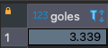
#### Respuesta
El Barcelona a marcado un total de **3.339** goles.

### Ejercicio 2
> ¿Cuántos partidos han terminado 0-0?
#### SQL
```sql
SELECT COUNT(1)
FROM partidos.partidos p 
WHERE goles_local = 0 AND goles_visitante  = 0;
```
#### Resultados
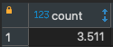
#### Respuesta
En el dataset encontramos un total de **3.511** empates 0-0.

### Ejercicio 3
> ¿En qué temporada se han marcado más goles?
#### SQL
```sql
SELECT 	temporada,
		SUM(goles_local + goles_visitante) as goles	
FROM partidos.partidos p 
GROUP BY temporada
ORDER BY goles DESC
LIMIT 1;
```
#### Resultados
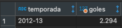
#### Respuesta
La temporada 2012-13 es la que mas goles registró, con un total de **2.224**

### Ejercicio 4
> ¿Cuál es el equipo que tiene el record de meter más goles como local? ¿Y cómo visitante?
#### SQL
```sql
WITH goles_local AS(
	SELECT 	local AS equipo, 
			SUM(goles_local) goles,
			DENSE_RANK() OVER(ORDER BY SUM(goles_local) DESC) AS ranking
	FROM partidos.partidos p 
	GROUP BY local
), goles_visitante AS(
	SELECT 	visitante AS equipo,
			SUM(goles_visitante) goles,
			DENSE_RANK() OVER(ORDER BY SUM(goles_visitante) DESC) AS ranking
	FROM partidos.partidos 
	GROUP BY visitante 
)
SELECT 'como local' AS "goleador", equipo, goles, ranking
FROM goles_local gl
WHERE ranking = 1
UNION ALL 
SELECT 'como visitante', equipo, goles, ranking
FROM goles_visitante gv
WHERE ranking = 1;
```
#### Resultados
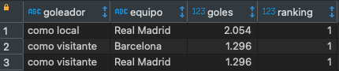
#### Respuesta
El **record de goles como local** se lo lleva el **Real Madrid** con un total de **2.054** goles convertidos. Mientras que el **record de goles como visitante** lo comparten **el Real Madrid y el Barcelona** con un total de **1.296** goles marcados fuera de casa.

### Ejercicio 5
> ¿Cuál son las 3 décadas en las que más goles se metieron?
#### SQL
```sql
SELECT 	EXTRACT(DECADE FROM TO_DATE(fecha, 'DD/MM/YYYY'))*10 AS decada,
		SUM(goles_local + goles_visitante) goles
FROM partidos.partidos p 
GROUP BY decada
ORDER BY goles DESC
LIMIT 3;
```
#### Resultados
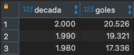
#### Respuesta
Las decadas de los **2000, 1990 y 1980** son las que lideran la estadística de mayor cantidad de goles por temporada.

### Ejercicio 6
> ¿Qué equipo es el mejor local en los últimos 5 años?
#### SQL
```sql
WITH ranking AS (
	SELECT 	local equipo, 
			SUM(CASE  
					WHEN goles_local > goles_visitante  THEN 1
					ELSE 0
				END) ganados,
			RANK() OVER (PARTITION BY local ORDER BY temporada DESC) AS tempo
	FROM partidos.partidos p 
	GROUP BY local, temporada
)
SELECT equipo, SUM(ganados) ganados_total
FROM ranking
WHERE tempo <= 5
GROUP BY equipo
ORDER BY ganados_total DESC 
LIMIT 1;
```
#### Resultados
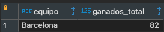
#### Respuesta
El **Barcelona** es el equipo que registra la mayor cantidad de partidos ganados como local, con un total **82 partidos** en las últimas 5 temporadas de las que se tienen datos.

### Ejercicio 7
> ¿Cuál es la media de victorias por temporada en los equipos que han estado menos de 10 temporadas en 1ª división?
> 
> El resultado tiene que ser una tabla con dos columnas: Equipo | Media de victorias por temporada
#### SQL
```sql
WITH victorias_local AS (
	SELECT 	local equipo, 
			temporada,
			SUM(CASE  
					WHEN goles_local > goles_visitante  THEN 1
					ELSE 0
				END) ganados
	FROM partidos.partidos p 
	GROUP BY local, temporada
), victorias_visitante AS (
	SELECT 	visitante  equipo, 
			temporada,
			SUM(CASE  
					WHEN goles_visitante > goles_local  THEN 1
					ELSE 0
				END) ganados
	FROM partidos.partidos p 
	GROUP BY visitante, temporada
)
SELECT 	vl.equipo, 
		SUM(vl.ganados+vv.ganados)/COUNT(1) media
FROM victorias_local vl
INNER JOIN victorias_visitante vv ON vv.equipo = vl.equipo AND vl.temporada = vv.temporada
GROUP BY vl.equipo
HAVING COUNT(1) < 10
ORDER BY equipo ASC;
```
#### Resultados
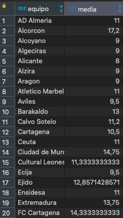

**Nota: la imagen muestra los primeros 20 equipos en orden alfabético que no jugaron mas de 10 temporadas en primera y sus respectivas medias de victorias**

#### Respuesta
El listado de la imagen superior muestra los equipos que no llegaron a jugar mas de 10 temporadas en primera, el total de equipos en esta situación es de 58.

### Ejercicio 8
> ¿Quién ha estado más temporadas en 1ª División: Barcelona o Real Madrid?
#### SQL
```sql
SELECT 	local, 
		COUNT(DISTINCT temporada)
FROM partidos.partidos
WHERE local IN ('Barcelona', 'Real Madrid')
GROUP BY LOCAL;
```
#### Resultados
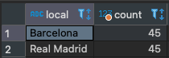
#### Respuesta
Tanto **Real Madrid** como **Barcelona** jugaron **45 temporadas** en 1ra, según los datos que se tienen.

### Ejercicio 9
> ¿Cuál es el record de goles como visitante en una temporada del Real Madrid?
#### SQL
```sql
SELECT  visitante , 
        temporada, 
        SUM(goles_visitante) goles
FROM partidos.partidos p 
WHERE visitante = 'Real Madrid'
GROUP BY visitante, temporada
ORDER BY goles DESC 
LIMIT 1;
```
#### Resultados
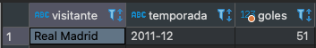
#### Respuesta
En la temporada **2011-12** el **Real Madrid** convirtió su **record de goles como visitante** en una única temporada, con un total 51 goles marcados fuera de casa.

### Ejercicio 10
> ¿En qué temporada se marcaron más goles en Cataluña?
#### SQL
```sql
WITH goles_bcn AS (
	SELECT 	local equipo, 
			temporada,
			SUM(goles_local+goles_visitante) total_goles,
			SUM(goles_local) goles_hechos,
			SUM(goles_visitante) goles_recibidos  
	FROM partidos.partidos p 
	WHERE local IN ('Barcelona', 'Espanyol')
	GROUP BY local, temporada
), mejor_temporada AS (
	SELECT	temporada, 
			SUM(total_goles) total_goles,
			SUM(goles_hechos) total_goles_hechos,
			SUM(goles_recibidos) total_goles_recibidos
	FROM goles_bcn
	GROUP BY temporada
	ORDER BY total_goles DESC 
	LIMIT 1
), total AS (
	SELECT 1 orden, m.temporada, g.equipo, g.goles_hechos, g.goles_recibidos, g.total_goles
	FROM goles_bcn g
	INNER JOIN mejor_temporada m ON m.temporada = g.temporada
	UNION 
	SELECT 2 orden, temporada, 'Total', total_goles_hechos, total_goles_recibidos, total_goles 
	FROM mejor_temporada 
	ORDER BY orden
)
SELECT temporada, equipo, goles_hechos, goles_recibidos, total_goles 
FROM total;

```
#### Resultados
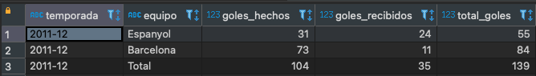
#### Respuesta
En la temporada **2011-12** fué en la que se convirtieron mas goles en **Catalunya**. Fueron un total de **139 goles**, de los cuales **55** se dieron durante encuentros del **Espanyol** (31 marcados + 24 recibidos) y **84** durante partidos del **Barcelona** (73 marcados + 11 recibidos).