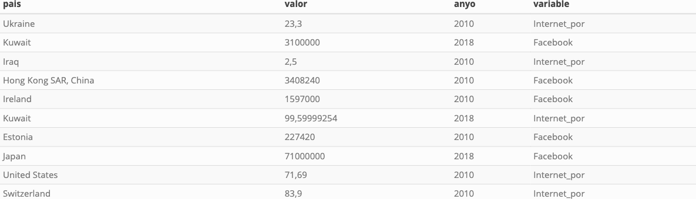
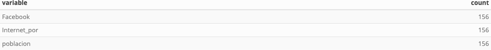

```{r setup, include=FALSE}
knitr::opts_chunk$set(echo = TRUE, fig.path="www/")

library(knitr)
library(pander)
library(kableExtra)
library(dplyr)
library(tidyr)

suppressPackageStartupMessages(library(tidyverse))

panderOptions('table.split.table', Inf)
panderOptions('decimal.mark', ",")
panderOptions('big.mark', ".")
panderOptions('missing', "")

options(knitr.kable.NA = '')
```

## Descripción de la tarea
El objetivo de esta actividad consiste en realizar la preparación de datos inicial para analizar, en fases posteriores, las métricas y mejorar la calidad de los datos.

Los datos a preparar están contenidos en la tabla FACEBOOK_2010_2018_RAW.csv.

- Pais: nombre del país. Un mismo país puede variar su nombre según el indicador.
- Valor: Valores numéricos. Puede presentar formatos distintos, según el indicador.
- Indicador: Formato: Año | indicador:
- Año: 2010 o 2018.
- Indicador:
    - Facebook: número de usuarios de Facebook en todo el país.
    - Internet_por: porcentaje de población usuaria de internet.
- poblacion: total de población por país.

## Tareas que debes realizar:
1. Carga los datos del fichero en un data frame. ¿Por qué no es un conjunto de datos ordenado?
2. Separa el año y el “indicador” en dos columnas separadas: anyo, variable. Presenta la tabla de las frecuencias de cada nueva variable.
3. Codifica el nombre de los países en una nueva columna “pais_r” donde, al analizar la tabla de frecuencias cada país, tenga frecuencia 6.
4. Pivota la tabla a formato wide de forma que cada variable tenga su propia columna y cada país dos filas (una para cada año). Comenta la estructura de la tabla (glimpse).
5. Transforma las tres variables (Facebook, Internet_por, poblacion) a formato numérico en tres variables nuevas con el sufijo “_num”. Aplica antes la/s transformación/es de las variables de texto que creas conveniente. Presenta el summary de las variables nuevas.
6. Analiza y comenta si observas alguna otra inconsistencia en los datos preparados.
7. Escribe cuatro líneas explicando (para un lector no técnico) la penetración de Facebook y de Internet en España.

# Solución
## Apartado 1
### Carga de los datos
```{r}
data <- read.csv(url("https://raw.githubusercontent.com/griu/mbdds_fc20/master/gestion_datos/www/Facebook_10_18_raw.csv"), 
                sep = ";")

df <- as_tibble(data)
```

### Visualización
```{r echo=FALSE, results='hide', warning=FALSE}
kable(df %>% head(10), "html", booktabs=TRUE) %>%
  kable_styling(bootstrap_options=c("striped", "hover", "condensed", "responsive")
  ,font_size = 15,full_width = T) %>%
  save_kable("/Users/lgutierrez/Proyectos/master/M3/A3/temp/df.png")
```
{width=700px}

### Respuesta
No es un conjunto de datos ordenado puesto que cada fila no representa el total características de una observación. 
Podemos observar que dentro de la variable `indicador`, estan presentes las variables `anio` y `variable` apiñadas. Debemos splitear la columna indicador para  obtener un conjunto de datos ordenado.

## Apartado 2
```{r}
df_aux <- df %>%
    separate(indicador, into = c("anyo", "variable"), sep = "\\|")
```

```{r echo=FALSE, results='hide', warning=FALSE}
kable(df_aux %>% head(10), "html", booktabs=TRUE) %>%
  kable_styling(bootstrap_options=c("striped", "hover", "condensed", "responsive")
  ,font_size = 15,full_width = T) %>%
  save_kable("/Users/lgutierrez/Proyectos/master/M3/A3/temp/df_aux.png")
```
{width=700px}

Veamos los valores que toman estas nuevas variables y sus respectivas frecuencias:
Primero analicemos la variable `anyo`:
```{r echo=FALSE, results='hide', warning=FALSE}
kable(df_aux %>% group_by(anyo) %>% summarise(count = n()), "html", booktabs=TRUE) %>%
  kable_styling(bootstrap_options=c("striped", "hover", "condensed", "responsive")
  ,font_size = 15,full_width = T) %>%
  save_kable("/Users/lgutierrez/Proyectos/master/M3/A3/temp/frec_anyo.png")
```
{width=700px}

Veamos ahora la columna `variable`: 
```{r echo=FALSE, results='hide', warning=FALSE}
kable(df_aux %>% group_by(variable) %>% summarise(count = n()), "html", booktabs=TRUE) %>%
  kable_styling(bootstrap_options=c("striped", "hover", "condensed", "responsive")
  ,font_size = 15,full_width = T) %>%
  save_kable("/Users/lgutierrez/Proyectos/master/M3/A3/temp/frec_var.png")
```
{width=700px}

## Apartado 3
Agregaremos nuestro dataset por pais y aplicaremos una función `count()` para determinar la cantidad de ocurrencias. Vemos que algunos paises no cumplen la condición de frecuencia igual 6. Por lo tanto, debemos investigar y determinar cuales y por que no cumplen la condición esperada:
```{r echo=FALSE, results='hide', warning=FALSE}
kable(df_count %>% filter(n != 6), "html", booktabs=TRUE) %>%
  kable_styling(bootstrap_options=c("striped", "hover", "condensed", "responsive")
  ,font_size = 15,full_width = T) %>%
  save_kable("/Users/lgutierrez/Proyectos/master/M3/A3/temp/df_count.png")
```
{width=700px}

```{r}
df %>% filter(pais == 'Taiwan')

df[df$pais == 'Taiwan',]
```

```{r}
df %>% filter(is.na(df$valor))

df[is.na(df$valor), ]
```

```{r}
colnames(df)[colnames(df)=="pais"] <- "id"
```

```{r}
df_aux <- df %>% mutate(valor_isna = (is.na(valor)))
df_aux %>% filter(valor_isna == T)
```