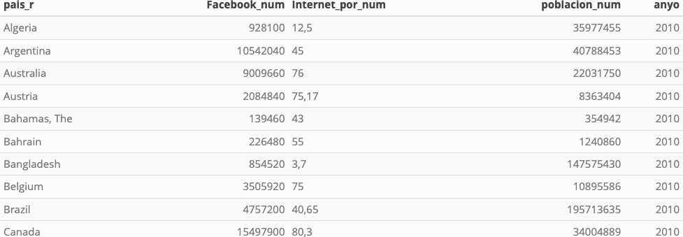

```{r setup, include=FALSE}
knitr::opts_chunk$set(echo = TRUE, fig.path="www/")

library(knitr)
library(pander)
library(kableExtra)
library(dplyr)
library(tidyr)

suppressPackageStartupMessages(library(tidyverse))

panderOptions('table.split.table', Inf)
panderOptions('decimal.mark', ",")
panderOptions('big.mark', ".")
panderOptions('missing', "")

options(knitr.kable.NA = '')
```

## Descripción de la tarea
Esta actividad consiste en crear métricas de análisis de la penetración de Facebook con dos objetivos:

- Medir la relación entre el porcentaje de usuarios de Facebook (sobre el total de población) y el porcentaje de usuarios de Internet de los distintos países.
- Comparar si esta relación ha cambiado a largo del tiempo.

Los datos a utilizar están contenidos en la tabla fb_long.csv. Las variables son:

- pais_r: nombre del país.
- Facebook_num: total de usuarios de Facebook en el país y año.
- Internet_por_num: porcentaje (de 0 a 100) de usuarios de Internet del país y año.
- poblacion_num: número de personas habitantes del país y año.
- anyo: año de observación.

Las tareas que debes realizar son:

1. Carga los datos del fichero en un data frame y calcula “Facebook_por_num” = “porcentaje de usuarios de Facebook sobre el total de población”. Presenta el summary de todas las variables del data frame.
   - Consejo: procura que Facebook_por_num tenga las mismas unidades de medida que Internet_por_num.
2. Haz un análisis univariante de Internet_por_num y Facebook_por_num separado por año. Calcula y comenta el histograma y estadísticos univariantes (centralización, dispersión, posición, concentración y forma).
3. Haz un gráfico para cada variable (Facebook_por_num y Internet_por_num) donde se pueda visualizar la variación entre 2010 y 2018 del valor medio (o el estadístico que prefieras). Explica qué observas en el gráfico.
4. Haz un análisis bivariante entre Facebook_por_num sobre Internet_por_num:
    - Gráfico de dispersión separando el año de observación en colores distintos.
    - Introduce, en el gráfico de dispersión, una recta de regresión (una por año).
    - Comenta si crees que la relación observada es lineal.
5. Propón alguna transformación sobre las variables del análisis y argumenta cuál es la mejor.
6. Compara, mediante stargazer, los coeficientes de la recta de regresión de Facebook_por_num sobre Internet_por_num en 2010 y 2018. Interpreta el significado de los coeficientes de la regresión en cada año.
7. A partir de los datos del punto anterior, comenta de qué forma beneficia a Facebook el hecho que, en 2018, el coeficiente de Internet_por_num sea muy superior al observado en el año 2010.

# Solución
## Apartado 1
### Carga de los datos
Obtenemos los datos del link proporcionado e instanciamos un `tibble` dataframe:

```{r}
# leemos los datos utilizando `read.csv`
data <- read.csv(url("https://raw.githubusercontent.com/griu/mbdds_fc20/master/gestion_datos/www/fb_long.csv"), 
                sep = ";")

# creamos un dataframe tibble a partir de los datos
df <- as_tibble(data)

# creamos un auxiliar para no trabajar sobre nuestro dataframe original
df_aux <- df
```

### Visualización
Hacemos un summary del dataset:

```{r}
summary(df_aux)
```

Previsualizamos los datos:

```{r echo=FALSE, results='hide', warning=FALSE, fig.pos='H'}
kable(df_aux %>% head(10), "html", booktabs=TRUE) %>%
    kable_styling(bootstrap_options=c("striped", "hover", "condensed", "responsive")
    ,font_size = 15,full_width = T) %>%
    save_kable("temp/df.png")
```
{width=700px}

### Controles de calidad y sanitización
Necesitamos determinar si nuestro dataset es un conjunto ordenado y si cumple con las condiciones requeridas:

Controlamos que no existan valores de frecuencia que no coincidan con el criterio deseado, para ello agrupamos nuestro dataset por la variable `pais_r`, recordemos que buscamos dos ocurrencias por país: una para el año 2010 y otra para el año 2018:

```{r}
# listamos los registros que agrupados por `pais_r` no acumulan el critério de count == 2
df_aux %>% count(pais_r) %>% filter(n != 2)
```

Apreciamos que la codificacíon utilizada para la variable `pais_r` es homogenea y además se cumple la frecuencia de observaciones deseada por país.

Ahora nos ayudamos de la función `glimpse()` para ver los tipos de datos:
```{r}
glimpse(df_aux)
```

Podemos notar que las variables `Facebook_num` `poblacion_num` y `anyo` son de tipo **int**, mientras que la variable `Internet_por_num` es de tipo **char**, al igual que `pais_r`. 

Haremos una pequeña transformación de datos para la variable `Internet_por_num`, necesitamos que esta variable cuantitativa continua tenga el tipo de dato **numeric** para poder operar con ella correctamente. 

Como primera medida checkearemos que los valores tomados por la variable puedan ser casteados a numeric. Crearemos una función `checkear_numeric` que devuelve TRUE o FALSE dependiendo de si el valor analizado puede o no ser casteado a numeric

```{r}
# declaramos la función de checkeo
checkear_numeric <- function(val) {
  # intentamos convertir a numeric
  numeric <- suppressWarnings(as.numeric(val))
  
  # devolvemos T o F
  return(is.na(numeric))
}
```

Buscamos si existen valores que no podrán ser casteados a `numeric` para la variable `Internet_por_num`, para ello utilizaremos una columna auxiliar que nos indicará si el valor tomado es o no problemático:

```{r}
# creamos una nueva columna con posibles casos problematicos
df_aux$internet_por_num_prob <- sapply(df_aux$Internet_por_num, checkear_numeric)

# checkeamos los casos problematicos
df_aux %>% filter(internet_por_num_prob == T)
```

Vemos que los resultados problematicos que obtenemos se derivan de la utilización de la coma (',') como separador decimal. Para corregirlo creamos una función que reemplace los caracteres de separación por los correctos:

```{r}
# declaramos la funcion limpiar
limpiar_numeric <- function(x) {
    # eliminamos puntos
    gsub("\\.", "", x) %>%
    # reemplazamos coma por punto
    gsub(",", ".", .)
}

# aplicamos la funcion limpiar a todos los valores
df_aux$internet_por_num_clean <- sapply(df_aux$Internet_por_num, limpiar_numeric)
```

Checkeamos si nuestra columna ahora tiene una mejor tasa de conversion al tipo de dato que esperamos:

```{r}
# ATENCION: se reutiliza columna auxiliar
df_aux$internet_por_num_prob <- sapply(df_aux$internet_por_num_clean, checkear_numeric)

# checkeamos los casos problematicos
df_aux %>% filter(internet_por_num_prob == T)
```

Queda un solo valor remanente, un `NA` para la observacion definida por (Taiwan, 2010).

Se determina acceder a los registros públicos de Taiwan y completar los valores faltantes. Dentro del sitio de [Estadiditicas Nacionales de Taiwan, de la Republica China](https://eng.stat.gov.tw).

En la categoría **Transportation, Storage, Communications and Tourism** podemos encontrar la siguiente [tabla](https://ws.dgbas.gov.tw/001/Upload/464/relfile/10924/232181/y077.pdf)

Donde se observa la métrica deseada, **Individual internet use rate (%)**, pero no registra datos para el año 2010. Tomamos, entonces, la determinación de remover los registros de Taiwan del dataset. Dado que no es eje de este trabajo la gestión de valores faltantes y tampoco es de interés específico los regístros de Taiwan para el año 2010:

```{r}
# filtramos los valores del dataset
df_aux <- df_aux %>% filter(!(pais_r == 'Taiwan' & anyo == 2010))

# controlamos
df_aux %>% select(pais_r,anyo,Internet_por_num,poblacion_num) %>% filter(pais_r == 'Taiwan' & anyo == '2010')
```


Checkeamos nuevamente si quedan valores no convertibles a numeric:

```{r}
# ATENCION: se reutiliza columna auxiliar
df_aux$internet_por_num_clean <- sapply(df_aux$Internet_por_num, limpiar_numeric)

# ATENCION: se reutiliza columna auxiliar
df_aux$internet_por_num_prob <- sapply(df_aux$internet_por_num_clean, checkear_numeric)

# checkeamos los casos problematicos
df_aux %>% filter(internet_por_num_prob == T)
```

Notamos que todos los valores de nuestra columna `Internet_por_num` pueden ser convertidos a `numeric`, por lo tanto procedemos a la transformación. Además haremos uso de un dataset auxiliar, `df_clean`, para contener nuestros datos sanitizados, correctamente casteados y homogeneizando los nombres de las columnas:

```{r}
# creamos nuevas columnas sanitizadas
df_clean <- df_aux %>% mutate(
        pais_r = as.factor(pais_r),
        internet_por_num_r = as.numeric(internet_por_num_clean),
        facebook_num_r = Facebook_num,
        poblacion_num_r = poblacion_num
) %>% select(pais_r, anyo, poblacion_num_r, internet_por_num_r, facebook_num_r)
```

Para dar cierre al apartado, creamos ahora nuestra nueva variable `facebook_por_num` la cual se determina como: Porcentaje de usuarios de Facebook sobre el total de población: 

```{r}
# creamos una nueva columna facebook_por_num
df_clean <- df_clean %>% mutate(
    facebook_por_num_r = facebook_num_r / poblacion_num_r * 100
)

# previsualizamos los datos
df_clean %>% select(pais_r, anyo, poblacion_num_r, internet_por_num_r, facebook_por_num_r)
```

Podemos observar nuestra nueva variable y su tipo de dato. 

Hagamos un summary de nuestro dataframe sanitizado:

```{r}
# vemos el summary del dataframe
df_clean %>% summary()
```

## Apartado 2
Procedemos al análisis univariante para las variables `internet_por_num_r` y `facebook_por_num_r`:

### internet_por_num
#### Análisis visual
Comenzamos con una previsualización de las frecuencias absolutas de la variable:

```{r, warning=FALSE, message=FALSE}
# creamos plot para `internet_por_num_r`
p1 <- ggplot(df_clean, aes(x=internet_por_num_r)) +
  labs(title='internet_por_num_r') +
  geom_histogram(fill='lightblue',
                 col='black')+
  facet_wrap( ~ anyo, nrow = 2)

p1
```

#### Estadísticos básicos
```{r}
# importamos moments: funciones skewness y kurtosis
library(moments) 

# armamos estadísticos para `internet_por_num_r`
df_clean %>% 
  group_by(anyo)%>%
  summarise(media=mean(internet_por_num_r),
           sd=sd(internet_por_num_r),
           CV=sd(internet_por_num_r)/mean(internet_por_num_r),
           asimetria=skewness(internet_por_num_r),
           apuntamiento=kurtosis(internet_por_num_r),
           minimo=min(internet_por_num_r),
           Q25=quantile(internet_por_num_r,0.25),
           mediana=median(internet_por_num_r),
           Q75=quantile(internet_por_num_r,0.75),
           maximo=max(internet_por_num_r)) %>% 
  pivot_longer(cols = -1, names_to = "Metrica", values_to = "Valor") %>%
  pivot_wider(names_from = anyo, values_from = Valor)
```

#### Centralidad
La media y la mediana aumentaron significativamente de 2010 a 2018, indicando un incremento general en los valores. Pasando de un valor medio de **48.2%** a un **73.1%** en la **proporción de usuarios con acceso a internet**. La mediana también creció pasando de **45%** a **78%**. Mientras que en el año 2010 la mediana se encuentra posicionada a izquierda de la media, indicando una leve concentración hacia valores mayores; durante el año 2018 se registró una medianda posicionada a derecha de la media, indincando una leve concentración  de valores por debajo de la mediana.

#### Dispersión
La desviación estándar para la variable `internet_por_num` disminuyó, indicando menor variabilidad en 2018, pasando de un **27.2%** de desiviación estándard a un **20.6%**. A su vez, el coeficiente de variación también disminuyó, sugiriendo una dispersión relativa menor en 2018 frente a las observaciones del 2010. Ambos años muestran datos homogeneos.

#### Posicion 
Los valores mínimos y máximos aumentaron, al igual que los cuartiles, indicando un desplazamiento hacia valores más altos en 2018. Mientras que en 2010 teníamos **minimo en 0.75%** y **máximo en 93.4%**, un **rango intercuartil de amplitud 46.7%**, que va de  **Q1 igual a 25% hasta Q3 igual a 71.4%**. En el año 2018 se registraron: **minimo en 18.6%**, **máximo en 99.7%**, **Q1 en 58.6% y Q3 en 88.9%**.

#### Asimetría
La asimetría mide la falta de simetría en la distribución. En 2010, la distribución es casi simétrica **-0.0808**, mientras que en 2018 la asimetría negativa es de **-0.794**, indicando una cola más larga a la izquierda.

#### Outliers
No cubriremos el análisis de outliers en éste trabajo práctico.

### facebook_por_num
#### Análisis visual
Comenzamos con una previsualización de las frecuencias absolutas de la variable:

```{r, warning=FALSE, message=FALSE}
# creamos plot para `facebook_por_num_r`
p2 <- ggplot(df_clean, aes(x=facebook_por_num_r)) +
  labs(title='facebook_por_num_r') +
  geom_histogram(fill='lightblue',
                 col='black')+
  facet_wrap( ~ anyo, nrow = 2) 

p2
```

#### Estadísticos básicos
```{r}
# armamos estadísticos para `facebook_por_num_r`
df_clean %>% 
  group_by(anyo)%>%
  summarise(media=mean(facebook_por_num_r),
           sd=sd(facebook_por_num_r),
           CV=sd(facebook_por_num_r)/mean(facebook_por_num_r),
           asimetria=skewness(facebook_por_num_r),
           apuntamiento=kurtosis(facebook_por_num_r),
           minimo=min(facebook_por_num_r),
           Q25=quantile(facebook_por_num_r,0.25),
           mediana=median(facebook_por_num_r),
           Q75=quantile(facebook_por_num_r,0.75),
           maximo=max(facebook_por_num_r)) %>% 
  pivot_longer(cols = -1, names_to = "Metrica", values_to = "Valor") %>%
  pivot_wider(names_from = anyo, values_from = Valor)
```

#### Centralidad
Para la variabla `facebook_por_num` los valores de media y la mediana tambien aumentaron significativamente de 2010 a 2018, indicando un incremento general en los valores. Mientras que para el año 2010 la mediana se encuentra posicionada a izquierda de la media, indicando una leve concentración hacia valores mayores; durante para el 2018 se registra una medianda posicionada a derecha de la media, indincando una leve concentración  de valores por debajo de la mediana.

#### Dispersión
La desviación estándar para la variable `facebook_por_num` aumentó, indicando mayor variabilidad en 2018, pasando de un **16.8%** de desiviación estándard a un **21.0%**. Sin embargo, el coeficiente de variación disminuyó, sugiriendo una dispersión relativa menor en 2018 frente a las observaciones del 2010. Para el año 2010 se obtiene un Coeficiente de Variaciación del 87%, lo que indica una media no muy representativa de la muestra y que los datos no son homogeneos. Para el 2018 el valor el CV es igual a 43%, lo que lo refiere como un conjunto de datos medianamente homogeneo.

#### Posicion 
Los valores mínimos y máximos aumentaron, al igual que los cuartiles, indicando un desplazamiento hacia valores más altos en 2018. Mientras que en 2010 teníamos **minimo en 0.0089%** y **máximo en 83.5%**, un **rango intercuartil** que va de  **Q1 igual a 2.90% hasta Q3 igual a 28.6%**. En el año 2018 se registraron: **minimo en 0.129%**, **máximo en 90.3%**, **Q1 en 41.8% y Q3 en 62.1%**.

#### Asimetría
La asimetría mide la falta de simetría en la distribución. En 2010, la distribución es asimétrica a la derecha (positiva), mientras que en 2018 es asimétrica a la izquierda (negativa).

#### Outliers
No cubriremos el análisis de outliers en éste trabajo práctico.

## Apartado 3
Analizaremos la evolución del estadistico **media** entre el año 2010 y 2018 para las variables `internet_por_num` y `facebook_por_num`. Comenzaremos graficando los histogramas separados por año para cada variable, y visualizando el valor tomando por la media en cada caso.

### internet_por_num
```{r, warning=FALSE, message=FALSE}
# calcular las medias
medias_internet <- df_clean %>%
  group_by(anyo) %>%
  summarize(media = mean(internet_por_num_r))
  
# creamos plot para `internet_por_num_r`
p3 <- ggplot(df_clean, aes(x=internet_por_num_r)) +
  labs(title='internet_por_num_r') +
  geom_histogram(fill='lightblue',
                 col='black')+
  geom_vline(data = medias_internet, aes(xintercept = media), color = 'red', linetype = 'dashed', size = 1) +
  geom_text(data = medias_internet, aes(x = media, y = 7.5, label = paste0("media = ", round(media, 2))), 
            color = 'brown', vjust = -0.5, size = 5) +
  facet_wrap( ~ anyo, nrow = 2)

p3
```

Para la variable `internet_por_num_r` el valor del estadístico **media** aumentó significativamente de 2010 a 2018, pasando de un **48.18%** a un **73.25%**. Marcando un crecimiento generalizado de los valores de variable para el año 2018.

### facebook_por_num
```{r, warning=FALSE, message=FALSE}
# calcular las medias por año
medias_facebook <- df_clean %>%
  group_by(anyo) %>%
  summarize(media = mean(facebook_por_num_r))
  
# creamos plot para `facebook_por_num_r`
p4 <- ggplot(df_clean, aes(x=facebook_por_num_r)) +
  labs(title='facebook_por_num_r') +
  geom_histogram(fill='lightblue',
                 col='black')+
  geom_vline(data = medias_facebook, aes(xintercept = media), color = 'red', linetype = 'dashed', size = 1) +
  geom_text(data = medias_facebook, aes(x = media, y = 10, label = paste0("media = ", round(media, 2))), 
            color = 'brown', vjust = -0.5, size = 5) +
  facet_wrap( ~ anyo, nrow = 2)

p4
```

Como comentamos anteriormente para la variable `facebook_por_num` el valor de **media** aumentó considerablemente, pasando de **19.15%** en 2010 a un **48,86%** en el 2018, indicando un incremento general en los valores.

## Apartado 4
#### Análisis visual mediante gráfico de dispersión
```{r}
# creamos columna auxiliar factorizando anyo
df_clean$anyo_r <- as.factor(df_clean$anyo)

# creamos plot para facebook_por_num_r sobre internet_por_num
p5 <- df_clean %>%
  ggplot(aes(x=internet_por_num_r, y=facebook_por_num_r, color=anyo_r)) +
  labs(title="facebook_por_num_r sobre internet_por_num", subtitle="Agrupado por año") +
  geom_point() +
  geom_smooth(method='lm', se=FALSE)+
  theme(legend.position="top")

p5
```

Para determinar si se nuestro gráfico de dispersión se ajusta a un modelo lineal, obtendremos los estadísticos bidimensioles **Covarianza y Correlación** para las variables `internet_por_num_r` y `facebook_por_num_r` para cada año observado. Ellos nos ayudaran a entender la relación entre ambas variables:

#### Covarianza
```{r}
# calculamos covarianza para ambos años
cov(df_clean[df_clean$anyo == '2010', c('internet_por_num_r', 'facebook_por_num_r')],)
cov(df_clean[df_clean$anyo == '2018', c('internet_por_num_r', 'facebook_por_num_r')],)
```

De la tabla obtenida podemos ver que las variables poseen una **covarianza de 325.42** para el año 2010 y una **covarianza de 310.42** para el año 2018.

Recordemos que la *Covarianza* es una medida de la variabilidad conjunta de las variables $X$ e $Y$.

**El signo de la covarianza indica el sentido en el que varían conjuntamente** las dos variables. Por tanto:

* Si la covarianza(x,y) > 0, entonces las **variables $X$ e $Y$ varían en el mismo sentido**. Las dos variables crecen o decrecen a la vez (**nube de puntos creciente**). Por ejemplo a mayor *Inversion*, mayor *Venta*.

* Si la covarianza(x,y) < 0, entonces las **variables $X$ e $Y$ varían en sentido opuesto**. Cuando una variable crece, la otra variable tiene tendencia a decrecer (**nube de puntos decreciente**).

* Si **las variables son independientes, la covarianza es nula**. El recíproco no es cierto.

En consonancia con lo descripto podemos asumir una relación directa entre las variables *internet_por_num_r* y *facebook_por_num_r* para ambos años **2010 y 2018**. Es decir, ambas variables crecen y decrecen conjuntamente. 

Se puede arribar a las mismas conclusiones desde el análisis gráfico del apartado anterior.

#### Correlación
```{r}
# calculamos correlación para ambos años
cor(df_clean[df_clean$anyo == '2010', c('internet_por_num_r', 'facebook_por_num_r')], method = 'pearson')
cor(df_clean[df_clean$anyo == '2018', c('internet_por_num_r', 'facebook_por_num_r')], method = 'pearson')
```

**El coeficiente de correlación lineal** es una **medida adimensional** que determina el grado de ajuste entre una nube de puntos y una recta de regresión. Es decir, un coeficiente que **mide el grado de variación conjunta** entre las variables. Se representa por $r$.

Se define como:

$$ \\ {
   r = \frac{\sigma_{xy}} { \sigma_{x} \sigma_{y}}  
} \\ $$

Este coeficiente determina si existe relación lineal entre dos variables, toma valores entre -1 y 1, esto es:

$$ \\ {
  -1 \leq r \leq 1  
} $$

Para las variables `internet_por_num_r` y `facebook_por_num_r` obtuvimos un valor del coeficiente de correlación en torno a los **0.71** para el año 2010 y al rededor de **0.69** para el 2018. Lo que indica:

- $r$ positivo: implica que existe una dependencia aleatoria directa entre las variables.
- $|r|$ está próximo a 1: implica que existe una relación lineal considerable entre las variables.
- $|r|$ disminuyendo entre 2010 y 2018 indica que el ajuste a una recta lineal simple empeora conforme pasamos de año, problablemente debido a una saturación del mercado, es decir el aumento de población con conectividad a internet deja de influir en el aumento de usuarios de la red social.

Podemos decir que para ambos años se observa un ajuste moderado a bueno para el modelo de regresión lineal simple entre las variables `internet_por_num_r` y `facebook_por_num_r`.

## Apartado 5
Compararemos el ajuste de nuestro modelo con el de un modelo que utiliza una transformada logarítmica. Aplicaremos la transformada a ambas variables, y checkeamos coeficientes de correlación y determinación.

Tomemos las observaciones del año 2018 para compararlos con estadísticos bivariantes anteriormente obtenidos

```{r}
# calculamos columnas auxiliares
df_clean$internet_por_num_log <- log(df_clean$internet_por_num_r)
df_clean$facebook_por_num_log <- log(df_clean$facebook_por_num_r)

# calculamos matriz de correlación
cor(df_clean[df_clean$anyo == '2018', c('internet_por_num_log', 'facebook_por_num_log')], method = 'pearson')
```

Vemos que obtenemos un coeficiente de correlación menor al obtenido utilizando las escalas en nivel, pasamos de un coeficiente de correlación de **0.69** a uno de **0.55**, lo que nos dice que hay un peor ajuste para el modelo de regresión simple cuando utilizamos una transformada logarítmica.

Para poder comparar el impacto de las transformaciones en nuestro modelo de regresión lineal, utilizamos la función `stargazer()` que nos describe las característica ambos modelos.

```{r}
# importamos libreria
suppressPackageStartupMessages(library(stargazer))

# definimos ambos modelos
model_1 <- lm(facebook_por_num_r ~ internet_por_num_r, data=df_clean[df_clean$anyo == '2018',])
model_log <- lm(log(facebook_por_num_r) ~ log(internet_por_num_r), df_clean[df_clean$anyo == '2018',])

# presentamos resultados
stargazer(model_1,model_log,type="text")
```

Podemos observar como el coeficiente de determinación ($R^2$) disminuye para la regresión lineal utilizando las transforamciones logarítmicas, pasando de un **0.489** a un **0.311**. Además podemos notar que la desviación standard de los residuos es inferior en el modelo en escala logarítmica frente al de escala en nivel.

Consideramos mejor ajuste al que mejor coeficiente de determinación entrega, en este caso nuestro modelo con escala en nivel es el que mejor puntuación obtiene. Se investigó sobre otras posibilidades de transformación, como la `logit` o `raiz cuadrada`, pero se evitan tocar este práctico por motivos de síntesis.

## Apartado 6
Intentaremos aproximar la distribución de puntos entre `facebook_por_num_r` y `internet_por_num` a una función matemática que describa el comportamiento de las variables.

Utilizaremos la función de una recta en el plano (x,y), donde ecuación teórica de la recta es:
$$
  y = \beta_{0} + \beta_{1}x
$$

La función indica que para cada valor $x_{i}$ que tome la variable $x$ le corresponde un valor de $y_{i}$ a $y$, de manera que: $\beta_{0}$ es la ordenada al origen y $\beta_{1}$ la pendiente de la recta.

Nuestra aproximación no será perfecta, es decir nuestro modelo tendrá un error $ɛ$

$$
  y = \beta_{0} + \beta_{1}x + \varepsilon
$$


donde el error representa la diferencia entre el valor real y el predicho por el modelo

$$
  \varepsilon_{i} =  y_{i} - \widehat{y}_{i}
$$

Para obtener nuestras rectas haremos uso de la funcion `lm()` la cual nos calcula los coeficientes de correlación de nuestra regresión lineal simple. Compararemos los coeficientes de nuestras rectas de regresión para los modelos de los años 2010 y 2018:

```{r}
# declaramos ambos modelos, uno por cada año
model_2010 <- lm( facebook_por_num_r ~ internet_por_num_r, data=df_clean[df_clean$anyo == '2010',])
model_2018 <- lm( facebook_por_num_r ~ internet_por_num_r, data=df_clean[df_clean$anyo == '2018',])

# comparamos los modelos
stargazer(model_2010,model_2018, type="text")
```

#### Coeficiente de la variable $\beta_1$
- 2010: El coeficiente es **0.439** con un error estándar de **0.050**.
- 2018: El coeficiente es **0.720** con un error estándar de **0.084**.

El coeficiente para 2018 (0.720) es mayor que el de 2010 (0.439). Esto sugiere que en 2018, el impacto del acceso a internet en la proporción de usuarios de Facebook es más fuerte que en 2010. En otras palabras, un aumento en la proporción de usuarios de internet está asociado con un aumento mayor en la proporción de usuarios de Facebook en 2018 en comparación con 2010.
Conclusiones que se puede obtener del análisis visual en del **Apartado 4**

#### Constante $\beta_0$
- 2010: La constante es **−1.972** con un error estándar de **2.754**
- 2018: La constante es **−3.920** con un error estándar de **6.423.**

Las constantes negativas sugieren que, cuando la proporción de usuarios de internet es cero, la proporción de usuarios de Facebook sería negativa, lo cual no es posible en la realidad. Esto indica que la constante tiene un impacto menos interpretable directamente.

#### R2
- 2010: 0.508
- 2018: 0.489

El $R^2$ para 2010 es ligeramente mayor que para 2018, lo que sugiere que el modelo de 2010 explica un poco mejor la variabilidad de la proporción de usuarios de Facebook que el modelo de 2018

#### Error estándar residual
- 2010: 11.83
- 2018: 15.19

El error estándar residual es menor en 2010, lo que indica que las predicciones del modelo de 2010 están más cerca de los valores observados en comparación con el modelo de 2018.

## Apartado 7
Vemos como para el año 2018 el coeficiente $\beta_1$, es decir la pendiente de nuestra recta de regresión, es más grande. Lo que implica que el impacto de una misma variación en el porcetaje de acceso a internet, en el año 2018 representa un diferencial mayor que para el 2010, en el porcentaje de usuarios de facebook.